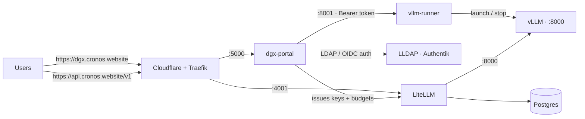

# Cronos — Self-Hosted LLM Platform

A self-hosted LLM inference platform running on a single **NVIDIA DGX Spark**
(GB10 Grace Blackwell, 128 GB unified memory, aarch64). It turns one GPU box into
a small multi-user AI service with an OpenAI-compatible API, per-user keys and
budgets, a self-service web portal, and an AI support assistant that can act on
your behalf.

It provides:

- an **OpenAI-compatible API** (LiteLLM) protected by per-user keys with token budgets;
- a **self-service portal** where each user (LDAP or SSO) creates keys, tries models
  in an in-browser **playground**, requests models, and tracks consumption;
- **Cronos**, an AI support assistant that answers questions *and* performs
  self-service actions (create a key, request budget, request a model…);
- a **runner** that launches/stops one vLLM model on the GPU on demand and
  auto-resumes it after a crash or reboot.

---

## Architecture



### Components

| Component | Role | Port | Runs as |
|---|---|---|---|
| **litellm** | OpenAI-compatible gateway: per-user keys, budgets, token accounting | `4001` | Docker container |
| **litellm-postgres** | LiteLLM database (keys, spend logs) | `5432` (internal) | Docker container |
| **dgx-portal** | Self-service web portal (Flask): login, keys, playground, support, admin | `5000` | Docker container (non-root) |
| **vllm-runner** | Daemon driving **one** vLLM process (start/stop/logs) with auto-resume | `8001` | systemd service on the host |
| **vLLM** | OpenAI-compatible inference server (the actual GPU engine) | `8000` | process spawned by the runner |

> Only one model runs on the GPU at a time. Launching another replaces the current one.

---

## Quick start

Prerequisites: a DGX Spark (or any CUDA host), a reachable LLDAP server, and outbound
internet for pulling images and model weights.

```bash
# One-shot bootstrap: installs Docker, Python/pipx, vLLM, clones the repo,
# generates .env, installs the systemd units and brings the stack up.
curl -fsSL https://raw.githubusercontent.com/Sunderrrr/dgx-spark-llm-platform/master/install.sh | sudo bash
```

Or manually:

```bash
git clone https://github.com/Sunderrrr/dgx-spark-llm-platform.git
cd dgx-spark-llm-platform
sudo ./install.sh          # installs packages + systemd units, generates .env
#   → then fill the remaining secrets in .env (LDAP/OIDC/SMTP/Discord)
docker compose up -d       # portal + gateway + database
```

Then open the portal (`http://<host>:5000`, or your HTTPS domain behind Traefik),
go to **Admin**, and launch a model from the catalog.

---

## Configuration (`.env`)

`docker-compose.yml` injects these into `dgx-portal` / `litellm`. `install.sh`
(via `setup.sh`) generates the random secrets; fill in the rest. See `.env.example`.

| Variable | Purpose |
|---|---|
| `WEBUI_SECRET_KEY` | Flask session signing key |
| `LITELLM_MASTER_KEY` | LiteLLM master key (gateway admin) |
| `POSTGRES_PASSWORD` | LiteLLM database password |
| `LLDAP_ADMIN_PASSWORD` | LDAP bind (user/group lookup, notification emails) |
| `RUNNER_TOKEN` | Bearer token between `dgx-portal` and `vllm-runner` |
| `PUBLIC_API_URL` | Public API URL shown to users (default `https://api.cronos.website/v1`) |
| `OIDC_CLIENT_ID` / `OIDC_CLIENT_SECRET` | Authentik `dgx-spark` OIDC app |
| `OIDC_METADATA_URL` / `OIDC_REDIRECT_URI` / `OIDC_LOGOUT_URL` | OIDC endpoints |
| `OIDC_ADMIN_GROUP` | Group granting the admin role (default `adm_cronos`) |
| `SESSION_COOKIE_SECURE` | `1` behind an HTTPS proxy (Traefik), `0` for plain-HTTP LAN |
| `KEY_MAX_BUDGET` / `KEY_BUDGET_DURATION` | Default per-account budget |
| `DISCORD_WEBHOOK_URL`, `SMTP_*`, `ADMIN_EMAIL` | Request notifications |

> `.env` is **gitignored** — no secret is committed. `.env.example` holds only placeholders.

---

## Authentication

Two methods, handled by `dgx-portal`:

- **OIDC SSO (Authentik)** — primary. "Sign in with Cronos SSO". Flow:
  `/login/sso` → Authentik → `/api/oauth2-redirect`. Admin comes from the `groups`
  claim (`adm_cronos`), falling back to an LDAP lookup by username if absent.
- **LDAP (LLDAP)** — username/password fallback: direct bind, injection-escaped,
  empty-password binds rejected, with in-memory brute-force lockout (6 fails / 15 min).

Session hardening: `HttpOnly` + `SameSite=Lax` cookies + `Secure` behind TLS.
`ProxyFix` trusts Traefik's `X-Forwarded-*` headers.

---

## Token budget model

Budgets are enforced **per account** (a LiteLLM *user*), shared across all of that
user's keys — creating extra keys does not raise the cap. Weighted in
`litellm/config.yaml`:

- `output_cost_per_token: 1` → 1 generated token = 1 budget unit;
- `input_cost_per_token: 0.1` → prompt tokens count **10× less**.

Default: **60,000,000 weighted tokens/day** per account (editable in
**Admin → token limit**, no restart). Admins are uncapped. Over budget → HTTP
`429 budget_exceeded`. The portal shows a banner once an account passes 85%.

---

## Using the API

OpenAI-compatible endpoint: **`https://api.cronos.website/v1`**. Every call needs a
key issued from the portal (`Authorization: Bearer sk-…`).

```bash
curl https://api.cronos.website/v1/chat/completions \
  -H "Authorization: Bearer sk-your-key" \
  -H "Content-Type: application/json" \
  -d '{"model":"ornith-35b-fp8","messages":[{"role":"user","content":"Hello!"}]}'
```

The **My API keys** page generates ready-to-paste snippets for OpenCode, Hermes
Agent, Codex CLI, Aider, Continue.dev, Cursor, LangChain, the Python SDK, cURL and
env vars — key and endpoint pre-filled.

> For **OpenCode**, the config uses a dedicated `dgx-cronos` provider (not `openai`)
> so it won't clash with an official OpenAI account.

---

## Portal features

- **My API keys** — create/revoke keys, see per-key spend and the shared account
  budget, request more tokens; integration snippets per tool.
- **Playground** — in-browser streaming chat with the active model; no client setup.
- **Support (Cronos)** — an AI assistant that sees your keys (masked), budget, the
  model catalog and server status, and can **act for you**: create a key, revoke one,
  request budget, request a model (admins also get launch/stop). Actions are always
  scoped server-side to the logged-in user; impactful ones require in-chat confirmation.
- **Leaderboard** (`/ranking`) — ranks users by weighted spend (day/week/month),
  colorblind-safe palette, from LiteLLM's Postgres spend logs.
- **Home** — live server stats (CPU/RAM/GPU), active-model health (tok/s, queue,
  TTFT, requests served), and your own hourly usage chart.
- **Admin** (`adm_cronos` only) — launch/stop models, live vLLM logs, add/edit/remove
  catalog models, set the default budget, approve token/model requests, per-user
  consumption.

---

## Operations

### Launch a model

Via the portal (**Admin → Launch**) or the runner API directly:

```bash
curl -H "Authorization: Bearer $RUNNER_TOKEN" -H "Content-Type: application/json" \
  -d '{"hf_model_id":"deepreinforce-ai/Ornith-1.0-35B-FP8","model_name":"ornith-35b-fp8",
       "vllm_args":"--enable-auto-tool-choice --tool-call-parser qwen3_coder --dtype bfloat16 --max-model-len 262144 --gpu-memory-utilization 0.7 --max-num-seqs 8"}' \
  http://127.0.0.1:8001/launch
```

### Auto-resume

The runner persists the last successful launch (`/var/lib/vllm-runner/last_model.json`)
and **relaunches it** after a process crash, a service restart or a reboot. A manual
`/stop` clears that state (no resume). Capped at 3 consecutive attempts.

### systemd services

| Unit | Role |
|---|---|
| `vllm-runner.service` | The runner daemon (non-root `vllmrunner` user) |
| `vllm-restrict.service` | iptables: host ports **8000**/**8001** limited to localhost + Docker bridge |
| `cronos-docker-restrict.service` | DOCKER-USER rules: **4001** to LAN+VPN, **5000** to Traefik only |

---

## Security

- **LiteLLM API (4001)**: no request without a valid key (`401`), budgets enforced
  (`429`). Restricted by firewall to the LAN + VPN; the intended public surface is
  via Traefik.
- **vLLM (8000) and runner (8001)**: firewalled to localhost + Docker bridge. The
  runner also requires a **Bearer token** and **allowlists** `vllm_args` (blocks
  `--trust-remote-code` and overriding critical flags), and runs **non-root**.
- **Portal**: LDAP/SSO auth, hardened cookies, security headers, SRI on CDN assets,
  non-root container with dropped capabilities, IDOR / open-redirect / LDAP-injection
  guards, login brute-force lockout.
- **Published ports** are filtered in `DOCKER-USER`: `4001` (API) reachable from the
  LAN and the Netbird VPN, `5000` (portal) from Traefik only (HTTPS).

### Exposing the API publicly

Path: `api.cronos.website` (**Cloudflare, proxied**) → **Traefik** →
`http://dgx.cronos.lan:4001` (LiteLLM, internal HTTP — TLS terminated at the proxy).
Only route to `4001`, never `8000`/`8001`. Consider a per-key rate limit (rpm/tpm) in
LiteLLM and a Cloudflare rate rule before opening to the internet — budgets cap
tokens/day, not request rate on a single GPU.

---

## Repository layout

```
.
├── install.sh                # one-shot host bootstrap (packages + systemd + .env)
├── setup.sh                  # generates .env with random secrets
├── docker-compose.yml        # postgres + litellm + dgx-portal
├── .env.example              # placeholders (no real secrets)
├── litellm/
│   └── config.yaml           # models, token pricing, model_info
├── dgx-portal/               # Flask portal
│   ├── app.py                # routes, LDAP+OIDC auth, budgets, support, admin
│   ├── requirements.txt
│   ├── Dockerfile            # non-root image
│   └── templates/            # bi-theme UI (light/dark)
├── vllm-runner/
│   └── runner.py             # start/stop/logs daemon + auto-resume
└── systemd/                  # host units (runner, firewalls)
```

## License

MIT.
