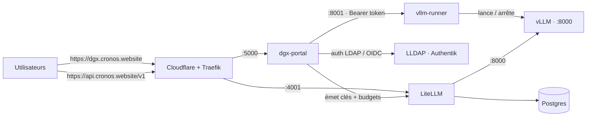

# DGX AI Platform

Plateforme d'inférence LLM auto-hébergée sur un **NVIDIA DGX Spark** (GB10 Grace Blackwell, 128 Go de mémoire unifiée, aarch64). Elle fournit :

- une **API compatible OpenAI** protégée par clés par utilisateur avec quotas de tokens (LiteLLM) ;
- un **portail self-service** où chaque utilisateur (authentifié LDAP ou SSO) crée ses clés, demande des modèles et suit sa consommation ;
- un **runner** qui lance/arrête à la demande un modèle vLLM sur le GPU et le relance tout seul après un crash ou un reboot.

---

## Architecture



### Composants

| Composant | Rôle | Port | Exécution |
|---|---|---|---|
| **litellm** | Passerelle API compatible OpenAI : clés par utilisateur, budgets, comptage tokens | `4001` | conteneur Docker |
| **litellm-postgres** | Base de données de LiteLLM (clés, dépenses) | `5432` (interne) | conteneur Docker |
| **dgx-portal** | Portail web self-service (Flask) : login, clés, demandes, admin | `5000` | conteneur Docker |
| **vllm-runner** | Daemon qui pilote **un** process vLLM (start/stop/logs), avec reprise auto | `8001` | service systemd sur l'hôte |
| **vLLM** | Serveur d'inférence OpenAI-compatible (le vrai moteur GPU) | `8000` | process lancé par le runner |

> Un seul modèle tourne à la fois sur le GPU. Le runner remplace le modèle courant quand on en lance un autre.

---

## Démarrage rapide

Prérequis : Docker + Docker Compose, un serveur LLDAP joignable, vLLM installé sur l'hôte (pour le runner), Python 3.

```bash
# 1. Générer le .env (secrets aléatoires)
./setup.sh
#   → remplir ensuite dans .env : LLDAP_ADMIN_PASSWORD, OIDC_*, SMTP_*, DISCORD_WEBHOOK_URL…

# 2. Lancer la stack (portail + gateway + db)
docker compose up -d

# 3. Installer le runner vLLM sur l'hôte (hors Docker)
sudo cp systemd/vllm-runner.service     /etc/systemd/system/
sudo cp systemd/vllm-restrict.service   /etc/systemd/system/
sudo cp systemd/99-vllm-runner-needrestart.conf /etc/needrestart/conf.d/
sudo systemctl daemon-reload
sudo systemctl enable --now vllm-runner.service vllm-restrict.service
```

Puis se connecter au portail (`http://<hôte>:5000`), aller dans **Admin**, et lancer un modèle du catalogue.

---

## Configuration (`.env`)

Le `docker-compose.yml` injecte ces variables dans `dgx-portal`. Secrets générés par `setup.sh` ; le reste est à remplir. Voir `.env.example`.

| Variable | Rôle |
|---|---|
| `SECRET_KEY` (`WEBUI_SECRET_KEY`) | Clé de signature des sessions Flask |
| `LITELLM_MASTER_KEY` | Clé maître LiteLLM (admin de la gateway) |
| `POSTGRES_PASSWORD` | Mot de passe de la base LiteLLM |
| `LLDAP_ADMIN_PASSWORD` | Bind LDAP (lookup users/groupes) |
| `RUNNER_TOKEN` | Bearer token entre `dgx-portal` et `vllm-runner` |
| `PUBLIC_API_URL` | URL publique affichée aux utilisateurs (défaut `https://api.cronos.website/v1`) |
| `OIDC_CLIENT_ID` / `OIDC_CLIENT_SECRET` | App OIDC Authentik `dgx-spark` |
| `OIDC_METADATA_URL` / `OIDC_REDIRECT_URI` / `OIDC_LOGOUT_URL` | Endpoints OIDC |
| `OIDC_ADMIN_GROUP` | Groupe donnant le rôle admin (défaut `adm_cronos`) |
| `SESSION_COOKIE_SECURE` | `1` derrière un proxy HTTPS (Traefik), `0` en HTTP LAN |
| `KEY_MAX_BUDGET` / `KEY_BUDGET_DURATION` | Budget par défaut des nouvelles clés |
| `DISCORD_WEBHOOK_URL`, `SMTP_*`, `ADMIN_EMAIL` | Notifications des demandes |

> `.env` est **gitignored** : aucun secret n'est commité. `.env.example` ne contient que des placeholders.

---

## Authentification

Deux méthodes, gérées par `dgx-portal` :

- **SSO OIDC (Authentik)** — méthode principale. Bouton « Se connecter avec le SSO Cronos ». Flux : `/login/sso` → Authentik → `/api/oauth2-redirect`. Le rôle admin vient du claim `groups` (`adm_cronos`), avec repli sur un lookup LDAP par identifiant si le claim est absent.
- **LDAP (LLDAP)** — repli par identifiant/mot de passe. Bind direct, échappement anti-injection, rejet des mots de passe vides.

Durcissement des sessions : cookie `HttpOnly` + `SameSite=Lax` (compatible retour OIDC, protège du CSRF sur les POST) + `Secure` derrière TLS. `ProxyFix` fait confiance aux en-têtes `X-Forwarded-*` de Traefik.

---

## Modèle de tokens & tarification

Le « budget » d'une clé est exprimé en **tokens générés**. Réglé dans `litellm/config.yaml` :

- `output_cost_per_token: 1` → 1 token généré = 1 unité de budget ;
- `input_cost_per_token: 0.1` → les tokens du prompt comptent **10× moins**.

Budget par défaut : **2 000 000 tokens / jour** par clé (modifiable dans **Admin → Limite de tokens**, sans redémarrage). Dépassement → HTTP `429 budget_exceeded`. Les métadonnées de fenêtre de contexte (`max_input_tokens` / `max_output_tokens`) sont déclarées dans `model_info` pour que les clients (OpenChamber, etc.) les affichent.

---

## Utiliser l'API

Endpoint (compatible OpenAI) : **`https://api.cronos.website/v1`**. Chaque appel nécessite une clé émise depuis le portail (`Authorization: Bearer sk-…`).

```bash
curl https://api.cronos.website/v1/chat/completions \
  -H "Authorization: Bearer sk-votre-cle" \
  -H "Content-Type: application/json" \
  -d '{"model":"ornith-35b-fp8","messages":[{"role":"user","content":"Bonjour !"}]}'
```

La page **Mes clés API** du portail génère des snippets prêts à coller pour OpenCode, Codex CLI, Aider, Continue.dev, Cursor, LangChain, le SDK Python, cURL et les variables d'env — avec la clé et l'endpoint pré-remplis.

> Pour **OpenCode**, la config utilise un provider dédié `dgx-cronos` (et non `openai`) pour ne pas entrer en conflit avec un compte OpenAI officiel connecté via `/connect`.

---

## Panneau d'administration

Réservé aux membres du groupe `adm_cronos`. Permet de :

- **lancer / arrêter** un modèle du catalogue, voir les **logs vLLM en direct** (SSE relayé par le portail) ;
- **ajouter / supprimer** des modèles du catalogue (id Hugging Face + args vLLM) ;
- régler la **limite de tokens par défaut** des nouvelles clés ;
- traiter les **demandes de tokens** (approuver avec un montant → `POST /key/update` LiteLLM) et les **demandes de modèles** ;
- suivre la **consommation par utilisateur** (rafraîchie toutes les 3 s).

---

## Exploitation

### Lancer un modèle

Via le portail (**Admin → Lancer**) ou directement l'API du runner :

```bash
curl -H "Authorization: Bearer $RUNNER_TOKEN" -H "Content-Type: application/json" \
  -d '{"hf_model_id":"deepreinforce-ai/Ornith-1.0-35B-FP8","model_name":"ornith-35b-fp8",
       "vllm_args":"--enable-auto-tool-choice --tool-call-parser qwen3_coder --dtype bfloat16 --max-model-len 262144 --gpu-memory-utilization 0.7 --max-num-seqs 8"}' \
  http://127.0.0.1:8001/launch
```

### Reprise automatique

Le runner persiste le dernier lancement réussi (`/var/lib/vllm-runner/last_model.json`) et le **relance tout seul** après un crash du process, un redémarrage du service ou un reboot. Un `/stop` volontaire efface cet état (pas de reprise). Plafonné à 3 tentatives consécutives pour éviter le crash-loop.

### Services systemd

| Unité | Rôle |
|---|---|
| `vllm-runner.service` | Le daemon runner (utilisateur non-root `vllmrunner`) |
| `vllm-restrict.service` | Règles iptables : ports **8000** et **8001** restreints à `localhost` + bridge Docker |
| `99-vllm-runner-needrestart.conf` | Empêche `needrestart` de tuer le modèle lors des mises à jour système |

---

## Sécurité

- **API LiteLLM (4001)** : aucune requête sans clé valide (`401`), budgets appliqués (`429`). C'est la seule surface destinée à être publique.
- **vLLM (8000) et runner (8001)** : pare-feutés à `localhost` + bridge Docker (`DROP` ailleurs). Le runner exige en plus un **Bearer token** et **whiteliste** les `vllm_args` (bloque `--trust-remote-code` et l'écrasement des flags critiques). Il tourne en utilisateur **non-root**.
- **hawser (2376)** : accès Docker root-équivalent, restreint à une seule IP de confiance.
- **Portail** : auth LDAP/SSO, cookies durcis, en-têtes de sécurité (`X-Frame-Options`, `X-Content-Type-Options`, `Referrer-Policy`), intégrité SRI sur les assets CDN, protection anti-IDOR / open-redirect / injection LDAP.

### Exposer l'API sur Internet

Chemin : `api.cronos.website` (**Cloudflare, proxy activé**) → **Traefik** → `http://dgx.cronos.lan:4001` (LiteLLM, HTTP interne — TLS terminé au proxy). Ne router **que** vers `4001`, jamais `8000`/`8001`/`2376`.

Avant d'ouvrir au public, il reste recommandé d'ajouter un **rate-limit par clé** (rpm/tpm) côté LiteLLM et une règle de rate-limiting Cloudflare — le budget plafonne les tokens/jour mais pas le débit sur un GPU unique.

---

## Structure du dépôt

```
.
├── docker-compose.yml        # postgres + litellm + dgx-portal
├── setup.sh                  # génère .env avec des secrets aléatoires
├── .env.example              # placeholders (aucun secret réel)
├── litellm/
│   └── config.yaml           # modèles, tarification tokens, model_info
├── dgx-portal/               # portail Flask
│   ├── app.py                # routes, auth LDAP+OIDC, budgets, admin
│   ├── requirements.txt
│   ├── Dockerfile
│   └── templates/            # UI bi-thème (clair/sombre)
├── vllm-runner/
│   └── runner.py             # daemon start/stop/logs + reprise auto
└── systemd/                  # unités hôte (runner, pare-feu, needrestart)
```
