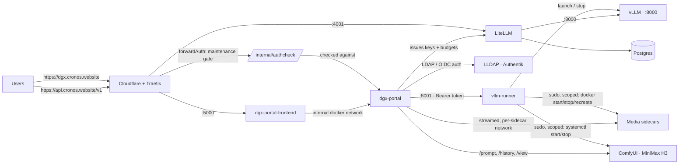
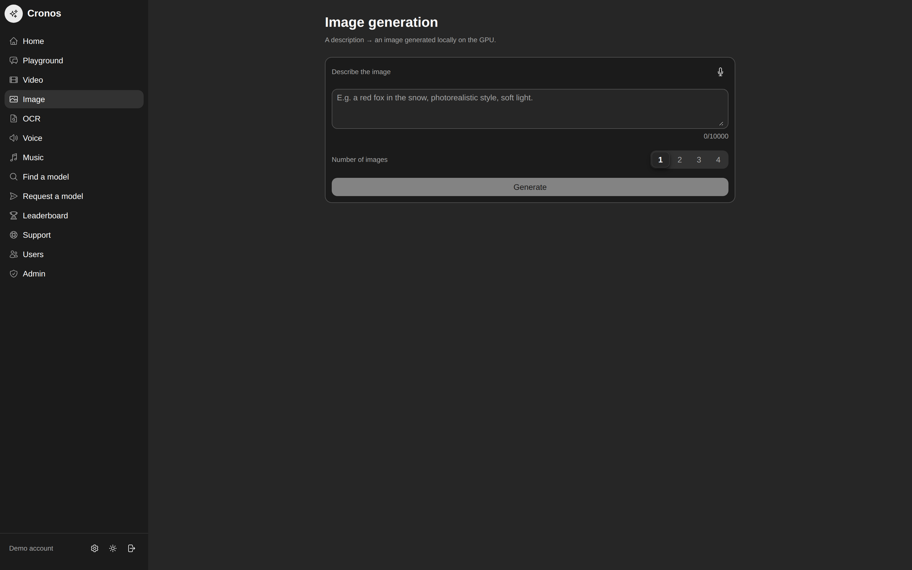
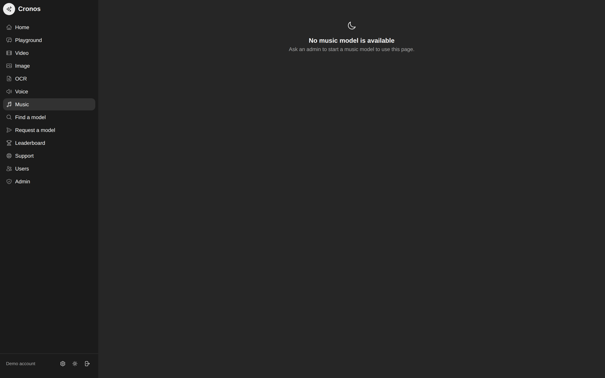
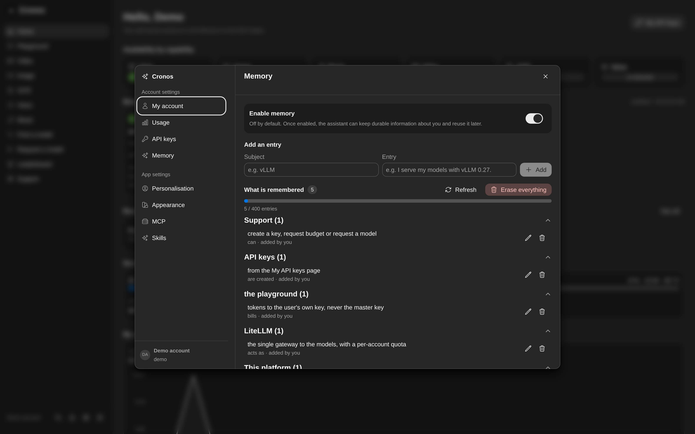
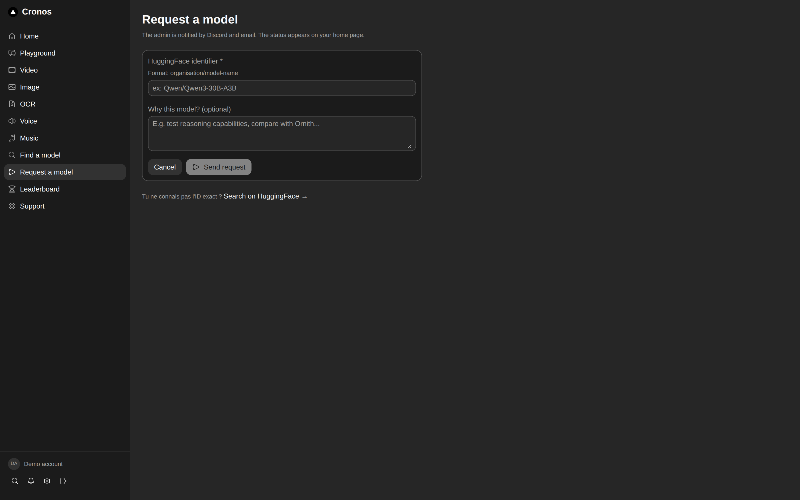

# Cronos — Self-Hosted LLM Platform

A self-hosted LLM inference platform running on a single **NVIDIA DGX Spark**
(GB10 Grace Blackwell, 128 GB unified memory, aarch64). It turns one GPU box into
a small multi-user AI service with an OpenAI-compatible API, per-user keys and
budgets, a self-service web portal, and an AI support assistant that can act on
your behalf.

It provides:

- an **OpenAI-compatible API** (LiteLLM) protected by per-user keys with token budgets,
  including a virtual **`auto-model`** that always routes to whatever chat model is
  currently loaded, so clients never need editing when the admin swaps models;
- a **self-service portal** where each user (LDAP or SSO) creates keys, tries models
  in an in-browser **playground**, requests models, and tracks consumption;
- **admin user management** — a dedicated page to create local accounts, group them,
  and set per-group / per-user quotas and rights, with each account's auth source
  (local / LDAP / SSO) shown at a glance;
- **Cronos**, an AI support assistant that answers questions *and* performs
  self-service actions (create a key, request budget, request a model…);
- a **runner** that launches/stops one vLLM model on the GPU on demand and
  auto-resumes it after a crash or reboot;
- always-on media sidecars — **OCR**, **video**, **image**, **music**, **voice
  cloning** and **dictation** — served alongside the main chat model and streamed
  into the portal, never exposed as separate public UIs;
- an admin **maintenance mode** that blocks non-admin API/portal traffic without
  stopping any model, enforced both in the portal and at the edge (Traefik);
- a UI available in **English and French**, switchable per account from Settings
  → Appearance (English by default).


---

## Contents

- [Architecture](#architecture)
- [Quick start](#quick-start)
- [Configuration (`.env`)](#configuration-env)
- [Authentication](#authentication)
- [Token budget model](#token-budget-model)
- [Using the API](#using-the-api)
- [Portal features](#portal-features)
- [Screenshots](#screenshots)
- [Operations](#operations)
- [Security](#security)
- [Repository layout](#repository-layout)
- [License](#license)

Two companion documents:

| Document | For |
|---|---|
| [`SECURITY.md`](SECURITY.md) | threat model, controls, accepted risks — operators and auditors |
| [`CLAUDE.md`](CLAUDE.md) | operating guide: golden rules, GB10 gotchas, reboot runbook, test gate |

---

## Architecture


```mermaid
flowchart LR
  U[Users] -->|https://dgx.cronos.website| CF[Cloudflare + Traefik]
  U -->|https://api.cronos.website/v1| CF
  CF -->|forwardAuth: maintenance gate| AC[/internal/authcheck/]
  AC -->|checked against| P
  CF -->|:5000| F[dgx-portal-frontend]
  CF -->|:4001| L[LiteLLM]
  F -->|internal docker network| P[dgx-portal]
  P -->|LDAP / OIDC auth| IDP[LLDAP · Authentik]
  P -->|issues keys + budgets| L
  P -->|:8001 · Bearer token| R[vllm-runner]
  R -->|launch / stop| V[vLLM · :8000]
  R -->|sudo, scoped: docker start/stop/recreate| S[Media sidecars]
  R -->|sudo, scoped: systemctl start/stop| CU[ComfyUI · MiniMax H3]
  L -->|:8000| V
  L --> PG[(Postgres)]
  P -->|streamed, per-sidecar network| S
  P -->|/prompt, /history, /view| CU
```

> **The backend is modular.** `dgx-portal` is not one big Flask file: it is a
> shared core (config, database, auth, guards), a set of clients for everything
> it talks to (LiteLLM, vLLM, ComfyUI, the sidecars, MCP, web search), and one
> route blueprint per feature. [`app.py`](dgx-portal/app.py) is a wiring facade —
> it builds the Flask app, registers the blueprints and boots the schema. See
> [Repository layout](#repository-layout).

### Components

| Component | Role | Port | Runs as |
|---|---|---|---|
| **litellm** | OpenAI-compatible gateway: per-user keys, budgets, token accounting | `4001` | Docker container |
| **litellm-postgres** | LiteLLM database (keys, spend logs) | `5432` (internal) | Docker container |
| **dgx-portal-frontend** | The UI (Next.js + Astryx): login, home, playground, media pages, support, find-a-model, leaderboard, admin, users (keys and memory live in the Settings dialog) | `5000` | Docker container (non-root) |
| **dgx-portal** | Backend (Flask): LDAP/OIDC auth, sessions, JSON API, business logic | internal only | Docker container (non-root) |
| **vllm-runner** | Daemon driving **one** vLLM process (start/stop/logs) with auto-resume, plus scoped start/stop/recreate of every media sidecar | `8001` | systemd service on the host |
| **vLLM** | OpenAI-compatible inference server (the main chat engine) | `8000` | process spawned by the runner |
| **OCR container** | vLLM serving an OCR-capable VLM (datalab-to/chandra-ocr-2 by default), swappable via an admin catalog | internal only | Docker container, own network + GPU slice |
| **ComfyUI** | Video generation graph engine (MiniMax H3 in **NVFP4** — the Blackwell-native 4-bit format the GB10 supports; 12.5 GB per UNET instead of 21 GB for the INT8 build) | `8188`, host-restricted | systemd service on the host |
| **Image container** | Text-to-image (diffusers). FLUX.2 Klein 4B by default — distilled to 4 steps, ~4–5 s per 1024×1024 image | internal only | Docker container, own network + GPU slice |
| **Music container** | Text-to-music (diffusers, MiniMax-Music3 & co) | internal only | Docker container, own network + GPU slice |
| **ASR container** | Whisper (`large-v3-turbo` by default) for Playground dictation | internal only | Docker container, own network + GPU slice |
| **Voice container** | Zero-shot voice cloning. Two interchangeable engines: **Qwen3-TTS** (default, Apache 2.0, 10 languages, 3 s cloning) or **Chatterbox** (MIT) | internal only | Docker container, own network + GPU slice |
| **SearXNG + crawl4ai** | Web search for the playground: SearXNG finds links, crawl4ai reads the pages | internal only | Docker containers, shared `web_net` |

> Only one **chat** model runs on the GPU at a time (launching another replaces the
> current one) — the media sidecars are separate, always-addressable backends running
> alongside it, each with its own GPU memory budget. On a single 128 GB unified-memory
> box that budget is genuinely shared: if a launch fails with an out-of-memory error,
> stop a sidecar from **Admin** rather than shrinking the chat model.

The UI used to be server-rendered Jinja templates served directly by Flask on
`:5000`. It's now a separate Next.js/Astryx frontend that owns `:5000` and
talks to Flask over the internal docker network for everything — auth, data,
and even the streaming chat endpoints (proxied through dedicated Next.js
Route Handlers so token-by-token streaming isn't buffered). Flask itself no
longer has a published port.

---

## Quick start

Prerequisites: a DGX Spark (or any CUDA host), a reachable LLDAP server, and outbound
internet for pulling images and model weights.

```bash
# One-shot bootstrap: installs Docker, Python/pipx, vLLM, clones the repo,
# generates .env, installs the systemd units and brings the stack up.
curl -fsSL https://raw.githubusercontent.com/Sunderrrr/dgx-spark-llm-platform/master/install.sh | sudo bash
```

Or manually:

```bash
git clone https://github.com/Sunderrrr/dgx-spark-llm-platform.git
cd dgx-spark-llm-platform
sudo ./install.sh          # installs packages + systemd units, generates .env
#   → then fill the remaining secrets in .env (LDAP/OIDC/SMTP/Discord)
docker compose up -d       # frontend + backend + gateway + database
```

Then open the portal (`http://<host>:5000`, or your HTTPS domain behind Traefik),
go to **Admin**, and launch a model from the catalog.

---

## Configuration (`.env`)

`docker-compose.yml` injects these into `dgx-portal` / `litellm`. `install.sh`
(via `setup.sh`) generates the random secrets; fill in the rest. See `.env.example`.
The backend reads them all in one place, [`config.py`](dgx-portal/config.py).

| Variable | Purpose |
|---|---|
| `WEBUI_SECRET_KEY` | Flask session signing key |
| `LITELLM_MASTER_KEY` | LiteLLM master key (gateway admin) |
| `POSTGRES_PASSWORD` | LiteLLM database password |
| `LLDAP_ADMIN_PASSWORD` | LDAP bind (user/group lookup, notification emails) |
| `RUNNER_TOKEN` | Bearer token between `dgx-portal` and `vllm-runner` (also used for the sidecar control routes) |
| `OCR_URL` | Internal URL of the OCR vLLM container (default `http://ocr:8000/v1`) |
| `VOICE_URL` | Internal URL of the voice container (default `http://voice:8004`) |
| `ASR_URL` | Internal URL of the Whisper transcription container (default `http://asr:8006`) |
| `IMAGE_URL` | Internal URL of the text-to-image container (default `http://image:8007`) |
| `MUSIC_URL` | Internal URL of the text-to-music container (default `http://music:8008`) |
| `COMFYUI_URL` | Internal URL of the ComfyUI video backend (default `http://host.docker.internal:8188`) |
| `PUBLIC_API_URL` | Public API URL shown to users (default `https://api.cronos.website/v1`) |
| `OIDC_CLIENT_ID` / `OIDC_CLIENT_SECRET` | Authentik `dgx-spark` OIDC app |
| `OIDC_METADATA_URL` / `OIDC_REDIRECT_URI` / `OIDC_LOGOUT_URL` | OIDC endpoints |
| `OIDC_ADMIN_GROUP` | Group granting the admin role (default `adm_cronos`) |
| `SESSION_COOKIE_SECURE` | `1` behind an HTTPS proxy (Traefik), `0` for plain-HTTP LAN |
| `KEY_MAX_BUDGET` / `KEY_BUDGET_DURATION` | Default per-account budget |
| `DISCORD_WEBHOOK_URL`, `SMTP_*`, `ADMIN_EMAIL` | Request notifications |

> `.env` is **gitignored** — no secret is committed. `.env.example` holds only placeholders.
>
> `docker-compose.yml` reads `BACKEND_URL` to reach Flask internally; the default
> (`http://dgx-portal:5000`) matches the compose service name and rarely needs changing.
> Note that `host.docker.internal` is **pinned to a fixed address** there rather than
> using `host-gateway` — see the networking gotcha in [`CLAUDE.md`](CLAUDE.md).

---

## Authentication

Two methods, handled by [`auth.py`](dgx-portal/auth.py):

- **OIDC SSO (Authentik)** — primary. "Sign in with Cronos SSO". Flow:
  `/login/sso` → Authentik → `/api/oauth2-redirect`. Admin comes from the `groups`
  claim (`adm_cronos`), falling back to an LDAP lookup by username if absent.
- **LDAP (LLDAP)** — username/password fallback: direct bind, injection-escaped,
  empty-password binds rejected, with brute-force lockout (6 fails / 15 min)
  persisted in SQLite so it survives a redeploy and is shared across workers.
  The counter is keyed **per IP and per username**: rotating source IPs can't
  dodge the threshold, since all attempts against one account feed the same
  counter regardless of origin.

Local accounts managed by an admin ([`local_users.py`](dgx-portal/local_users.py))
[local_users.py](dgx-portal/local_users.py) sit between the two: a hashed,
admin-managed account system checked before LDAP/SSO.

Sessions are **server-revocable**: the signed cookie carries only a random
`sid`, and a `user_sessions` row (same SQLite) lets an admin kill any active
session at will (`POST /admin/users/<username>/revoke-sessions`), revoke on
logout, and instantly drop a locked account's sessions (`enabled=0`). Sessions
predating the registry expire by age only, so the migration logs nobody out.

Session hardening: `HttpOnly` + `SameSite=Lax` cookies + `Secure` behind TLS.
`ProxyFix` trusts Traefik's `X-Forwarded-*` headers.

---

## Token budget model

Budgets are enforced **per account** (a LiteLLM *user*), shared across all of that
user's keys — creating extra keys does not raise the cap. Weighted in
`litellm/config.yaml`:

- `output_cost_per_token: 1` → 1 generated token = 1 budget unit;
- `input_cost_per_token: 0.1` → prompt tokens count **10× less**.

Default: **60,000,000 weighted tokens/day** per account (editable in
**Admin → token limit**, no restart). Admins are uncapped. Over budget → HTTP
`429 budget_exceeded`. The portal shows a banner once an account passes 85%.

---

## Using the API

OpenAI-compatible endpoint: **`https://api.cronos.website/v1`**. Every call needs a
key issued from the portal (`Authorization: Bearer sk-…`).

```bash
curl https://api.cronos.website/v1/chat/completions \
  -H "Authorization: Bearer sk-your-key" \
  -H "Content-Type: application/json" \
  -d '{"model":"auto-model","messages":[{"role":"user","content":"Hello!"}]}'
```

### The `auto-model` alias

Because the admin swaps the running chat model from time to time, hard-coding a
model name means editing every client on each swap. Instead, point clients at the
virtual model **`auto-model`**: it is a LiteLLM alias that always routes to the
chat model currently loaded, re-pointed automatically on every launch. Wire it
once and never touch your config again — the real model names stay registered and
keep working in parallel if you'd rather pin to a specific one.

The **Settings → API keys** panel generates ready-to-paste snippets for Claude
Code, OpenCode, Hermes Agent, Codex CLI, Aider, Continue.dev, Cursor, LangChain,
the Python SDK, cURL and env vars — key and endpoint pre-filled, with
**`auto-model` selected by default** while every named model stays selectable.

> For **OpenCode**, the config uses a dedicated `dgx-cronos` provider (not `openai`)
> so it won't clash with an official OpenAI account.

---

## Portal features

| Feature | Where | In one line |
|---|---|---|
| [API keys](#api-keys) | Settings ▸ API keys | create/revoke keys, see spend, copy integration snippets |
| [Playground](#playground) | `/playground` | streaming chat with the active model, attachments, dictation, web search |
| [Memory](#memory) | Settings ▸ Memory | opt-in knowledge graph of what the assistant knows about you |
| [Media pages](#media-pages) | `/ocr` `/video` `/image` `/music` `/voice` | OCR, video, image, music and voice cloning |
| [Support](#support-cronos) | `/support` | an assistant that can act on your account |
| [Find a model](#find-a-model) | `/search` | live Hugging Face search, GB10-tested first |
| [Request a model](#request-a-model) | `/request` | ask an admin for a model or more tokens |
| [Home](#home) | `/` | running backends, live server state, your usage |
| [Leaderboard](#leaderboard) | `/ranking` | weighted spend ranking |
| [Admin](#admin) | `/admin` | models, sidecars, catalog, quotas, maintenance |
| [Users](#users) | `/users` | local accounts, groups, quotas, auth sources |

### API keys

Create/revoke keys, see per-key spend and the shared account budget, request more
tokens; integration snippets per tool with `auto-model` pre-selected. Reached from
the sidebar gear or the home page's "My API keys" button — there is no standalone
`/keys` page.

### Playground

In-browser streaming chat with the active model; no client setup. Streamed
Markdown, a collapsible reasoning trace for thinking models, attachments, a live
context meter, per-message copy/regenerate, and a resizable **document panel**:
long answers get an "Open as document" button that pops the content into a wide,
side-by-side reading pane.

Includes **dictation** — a mic button transcribes what you say into the composer.
Deliberately self-hosted (Whisper on the GPU) rather than the browser's
`SpeechRecognition` API, which in Chrome ships the audio to Google's servers.

**Web search** is available on explicit request ("search the web for…"): SearXNG
finds the links, crawl4ai reads the pages, and the progress of each step is shown
live. See [`websearch_tools.py`](dgx-portal/websearch_tools.py) and the rules in
[`CLAUDE.md`](CLAUDE.md).

### Memory

An opt-in knowledge graph of what the assistant has learned about you. Facts are
stored as triples (subject, relation, object) in SQLite rather than as a flat
list, so "what do you know about X?" resolves to a node's neighbourhood instead of
injecting everything; traversal is a recursive CTE, so no graph database is
involved. Writing the same subject+relation again supersedes the older fact.

**Off by default** — this is personal data: nothing is recorded until the user
enables it, the page shows every stored fact, and nobody else can read it, admins
included.

### Media pages

- **OCR** — extract text from an image or scan, streamed token-by-token, with a
  toggle to visualize every detected region as bounding boxes over the source
  image; keeps your last 20 results.
- **Video** — turn a text description, with or without a reference image, into a
  short video with synced audio (MiniMax H3); keeps your last 3 results.
- **Image** — text-to-image; the default model is distilled to 4 steps, so a
  1024×1024 image lands in about 5 seconds.
- **Music** — text-to-music, same shape as the image page.
- **Voice** — record a sample straight from your microphone (1 min max, with
  playback before you commit) or upload one, give it any text, and get that text
  read back in that voice — zero-shot, a few seconds per generation. The page
  adapts to whichever engine is loaded. Browser recordings are converted to 24 kHz
  mono WAV client-side because `MediaRecorder` only emits WebM/Opus, which neither
  engine accepts.

All media pages show a clear empty state when their backend is not running,
instead of letting you submit into a dead end.

### Support (Cronos)

An AI assistant that sees your keys (masked), budget, the model catalog and server
status, and can **act for you**: create a key, revoke one, request budget, request
a model (admins also get launch/stop). Actions are always scoped server-side to the
logged-in user; impactful ones require in-chat confirmation. It can also call MCP
servers and skills you configure in Settings — with the guardrail that once
third-party tool output has entered the conversation, privileged tools are refused
for the rest of the turn.

### Find a model

Live search over the Hugging Face Hub (no local cache), filterable by task
including text/image/video generation, defaulting to models tagged as tested on
GB10; paginated rather than capped at the first page.

### Request a model

A short form to ask an admin for a model that isn't in the catalog, or for more
tokens. Requests land in Admin with the requester and their reason.

### Home

Every currently-running backend, each card labelled with what it does and the chat
card advertising the `auto-model` tip; a **Server state** panel with live CPU/RAM/GPU,
active-model health (tok/s, queue, TTFT, requests served, in/out context) and a
**Media services** strip folding sidecar activity metrics in next to it; plus your
own hourly usage chart. Sidecars are clearly marked "not exposed by the API".

### Leaderboard

Ranks users by weighted spend (day/week/month), colorblind-safe palette, from
LiteLLM's Postgres spend logs.

### Admin

Launch/stop models, live vLLM logs, add/edit/remove catalog models (chat, OCR and
voice), start/stop each sidecar independently of the chat model, set the default
budget, approve token/model requests, and a **maintenance mode** toggle that blocks
non-admin traffic everywhere without stopping any backend. Per-user consumption is
a **search box** — look up a single account to see its LiteLLM quota/spend plus its
media usage (untracked by LiteLLM, since none of it goes through a public API key).

### Users

A dedicated page to manage local accounts: create users with a hashed password,
assign them to **groups** carrying a default quota and admin right, override a
per-user quota, enable/disable, toggle admin, or reset a password. It lists every
known account with a badge for each authentication source — **Local**, **LDAP**,
**SSO** or **External** — recorded per login and cumulative.

---

## Screenshots

| Playground — streaming chat, dictation and web search | Support — the Cronos assistant, budget- and status-aware |
|---|---|
|  |  |

| OCR — text extracted live from a scanned document | Voice cloning — zero-shot from a short sample |
|---|---|
|  |  |

| Video generation — text- or image-driven, MiniMax H3 | Image generation — FLUX.2 Klein, 4 steps |
|---|---|
|  |  |

| Music generation | Memory — the opt-in knowledge graph |
|---|---|
|  |  |

| Find a model — Hugging Face catalog search | Request a model |
|---|---|
|  |  |


> **Refreshing these screenshots** — the UI is bilingual; capture them with the
> interface in **English** (Settings → Appearance → Language → English). Shoot each
> page below and save it under `assets/` with the exact filename, replacing the
> existing file:
>
> | Page | Route | File |
> |---|---|---|
> | Home dashboard | `/` | `assets/dashboard.png` |
> | Playground | `/playground` | `assets/playground.png` |
> | Support assistant | `/support` | `assets/support.png` |
> | OCR | `/ocr` | `assets/ocr.png` |
> | Voice cloning | `/voice` | `assets/voice.png` |
> | Video generation | `/video` | `assets/video.png` |
> | Image generation | `/image` | `assets/image.png` |
> | Music generation | `/music` | `assets/music.png` |
> | Memory | Settings ▸ Memory (or `/memory`) | `assets/memory.png` |
> | Find a model | `/search` | `assets/search.png` |
> | Settings → API keys | gear ▸ API keys | `assets/keys.png` |
> | Request a model | `/request` | `assets/request.png` |
> | Admin | `/admin` | `assets/admin.png` |
>
> The **Users** page (`/users`) and the **Leaderboard** (`/ranking`) are deliberately
> *not* published here — they list internal usernames (and, for the leaderboard,
> per-user consumption), so `assets/users.png` and `assets/ranking.png` are
> gitignored.

---

## Operations

Day-to-day runbook — reboot recovery, the test gate, model-serving gotchas — lives
in [`CLAUDE.md`](CLAUDE.md). The essentials:

### Launch a model

Via the portal (**Admin → Launch**) or the runner API directly:

```bash
curl -H "Authorization: Bearer $RUNNER_TOKEN" -H "Content-Type: application/json" \
  -d '{"hf_model_id":"deepreinforce-ai/Ornith-1.0-35B-FP8","model_name":"ornith-35b-fp8",
       "vllm_args":"--enable-auto-tool-choice --tool-call-parser qwen3_coder --dtype bfloat16 --max-model-len 262144 --gpu-memory-utilization 0.7 --max-num-seqs 8"}' \
  http://127.0.0.1:8001/launch
```

`vllm_args` is validated against a strict allowlist — see [`SECURITY.md`](SECURITY.md#21-model-launching--a-strict-allowlist-not-a-denylist).

### Auto-resume

The runner persists the last successful launch (`/var/lib/vllm-runner/last_model.json`)
and **relaunches it** after a process crash, a service restart or a reboot. A manual
`/stop` clears that state (no resume). Capped at 3 consecutive attempts.

### Tests

```bash
./dgx-portal/run-tests.sh        # backend suite, in a throwaway image
./scripts/pre-push-check.sh      # tests + secret scan — green is required to push
```

### systemd services

| Unit | Role |
|---|---|
| `vllm-runner.service` | The runner daemon (non-root `vllmrunner` user) |
| `vllm-restrict.service` | iptables: host ports **8000**/**8001** limited to localhost + Docker bridge |
| `cronos-docker-restrict.service` | DOCKER-USER rules: **4001** to LAN+VPN, **5000** to Traefik only |
| `cronos-web-restrict.service` | Drops new connections from the web-search network to the host |
| `cronos-ocr-restrict.service` | Prevents the OCR container from opening a connection to the portal |
| `cronos-traefik-boot.service` | One-shot at boot: waits for DNS, then restarts Traefik once (avoids the plugin/ACME race that 404s the site after a reboot) |

---

## Security

The gateway refuses any call without a valid key and enforces budgets; vLLM and the
runner are firewalled to localhost plus the docker bridge, and the runner
allowlists every launch flag, requires a Bearer token and runs non-root. No
`docker.sock` is mounted anywhere — sidecars are driven through scoped `sudo` on
root-owned wrapper scripts, each on its own docker network with no route to
LiteLLM, Postgres or Traefik. The portal adds LDAP/SSO auth, hardened cookies,
CSRF, a persisted brute-force lockout and a per-request nonce CSP, and a test
fails the build if any route loses its authentication guard.

**Full threat model, the complete list of controls, and the risks knowingly
accepted (starting with OCR, the one sidecar allowed to execute third-party code)
are in [`SECURITY.md`](SECURITY.md).**

### Exposing the API publicly

Path: `api.cronos.website` (**Cloudflare, proxied**) → **Traefik** →
`http://dgx.cronos.lan:4001` (LiteLLM, internal HTTP — TLS terminated at the proxy).
Only route to `4001`, never `8000`/`8001`. Consider a per-key rate limit (rpm/tpm) in
LiteLLM and a Cloudflare rate rule before opening to the internet — budgets cap
tokens/day, not request rate on a single GPU.

---

## Repository layout

```
.
├── install.sh                 # one-shot host bootstrap (packages + systemd + .env)
├── setup.sh                   # generates .env with random secrets
├── docker-compose.yml         # postgres + litellm + portal + frontend + search sidecars
├── .env.example               # placeholders (no real secrets)
├── README.md · SECURITY.md · CLAUDE.md
├── litellm/config.yaml        # models, token pricing, model_info
├── dgx-portal/                # Flask backend — see the module map below
├── dgx-portal-frontend/       # Next.js + Astryx UI (owns the public port 5000)
├── vllm-runner/runner.py      # model lifecycle daemon + scoped sidecar control
├── ocr/ · voice/ · voice-qwen/ · asr/ · image-gen/   # sidecar images and host wrappers
└── systemd/                   # host units (runner, firewalls, ComfyUI, recreate scripts)
```

### Backend module map (`dgx-portal/`)

The backend was a single 7 200-line file; it is now a shared core, a set of
clients, and one blueprint per feature. [`app.py`](dgx-portal/app.py) is a wiring
facade of ~870 lines: it creates the Flask app, sets security headers and the CSP,
keeps the handful of routes that other modules reach by name (`index`, `login`,
`logout`, the OAuth callbacks), registers every blueprint and boots the schema.

**Shared core** — imports nothing from the rest, so nothing can create a cycle:

| Module | Holds |
|---|---|
| [`config.py`](dgx-portal/config.py) | every environment-derived constant, in one place |
| [`db.py`](dgx-portal/db.py) | SQLite access, persisted settings, schema and migrations, the LiteLLM Postgres connector |
| [`auth.py`](dgx-portal/auth.py) | `login_required` / `admin_required`, CSRF, LDAP, brute-force lockout, session lifetime |
| [`guards.py`](dgx-portal/guards.py) | maintenance and rate-limit guards, shared SSE helpers, upload validation |

**Clients and adapters** — one module per thing the portal talks to:

| Module | Talks to |
|---|---|
| [`litellm_client.py`](dgx-portal/litellm_client.py) | LiteLLM: keys, budgets, accounts, model registration |
| [`vllm_health.py`](dgx-portal/vllm_health.py) | the engine: served models, health, throughput, context window, HF search |
| [`sidecars.py`](dgx-portal/sidecars.py) | the runner: launch/stop/logs, and every sidecar readiness probe |
| [`comfyui_client.py`](dgx-portal/comfyui_client.py) | ComfyUI, for video |
| [`mcp_client.py`](dgx-portal/mcp_client.py) | user-configured MCP servers |
| [`websearch.py`](dgx-portal/websearch.py) · [`websearch_tools.py`](dgx-portal/websearch_tools.py) | SearXNG + crawl4ai, and the tool layer exposing them to the model |
| [`notify.py`](dgx-portal/notify.py) · [`discord_notify.py`](dgx-portal/discord_notify.py) · [`announcements.py`](dgx-portal/announcements.py) | mail, Discord webhook and DMs, platform announcements |
| [`stats.py`](dgx-portal/stats.py) · [`local_users.py`](dgx-portal/local_users.py) · [`support.py`](dgx-portal/support.py) | consumption aggregates · local accounts · the Support assistant's tools |

**Route blueprints** — no `url_prefix`, so every path is unchanged:

| Module | Routes |
|---|---|
| [`chat_routes.py`](dgx-portal/chat_routes.py) | `/playground/chat`, `/support/chat` — SSE streaming |
| [`admin_routes.py`](dgx-portal/admin_routes.py) | `/admin/*` — models, sidecars, accounts, quotas, maintenance |
| [`conversation_routes.py`](dgx-portal/conversation_routes.py) · [`settings_routes.py`](dgx-portal/settings_routes.py) · [`memory_routes.py`](dgx-portal/memory_routes.py) | history · user settings · memory graph |
| [`ocr_routes.py`](dgx-portal/ocr_routes.py) · [`voice_routes.py`](dgx-portal/voice_routes.py) · [`asr_routes.py`](dgx-portal/asr_routes.py) | OCR · voice cloning · dictation |
| [`image_routes.py`](dgx-portal/image_routes.py) · [`music_routes.py`](dgx-portal/music_routes.py) · [`video_routes.py`](dgx-portal/video_routes.py) | the generation pages |
| [`preview_routes.py`](dgx-portal/preview_routes.py) · [`discord_routes.py`](dgx-portal/discord_routes.py) | sandboxed HTML preview · Discord account linking |

Also under `dgx-portal/`: `workflows/` (ComfyUI API-format templates for video),
`tests/`, `requirements.txt` and a non-root `Dockerfile` with no published port.

### Frontend (`dgx-portal-frontend/`)

Next.js 16 + Astryx. `app/(app)/` holds the pages, `lib/` the data helpers and the
i18n dictionary, `proxy.ts` the per-request nonce CSP and method-based routing, and
`lib/sseProxy.ts` the streaming relay to Flask. It has its own `README.md`,
`CLAUDE.md` and `AGENTS.md` — start there for UI work.

> The `/usr/local/sbin/*-recreate.sh` wrappers and `/etc/sudoers.d/vllmrunner-*`
> live on the host (root-owned). Their tracked sources are `ocr/ocr-recreate.sh`,
> `voice/voice-recreate.sh`, `asr/asr-recreate.sh`, `voice-qwen/voice-qwen-recreate.sh`,
> `systemd/image-recreate.sh` and `systemd/ocr-restrict.sh`; install with e.g.
> `install -o root -g root -m 0755 ocr/ocr-recreate.sh /usr/local/sbin/`.

## License

Licensed under MIT.
