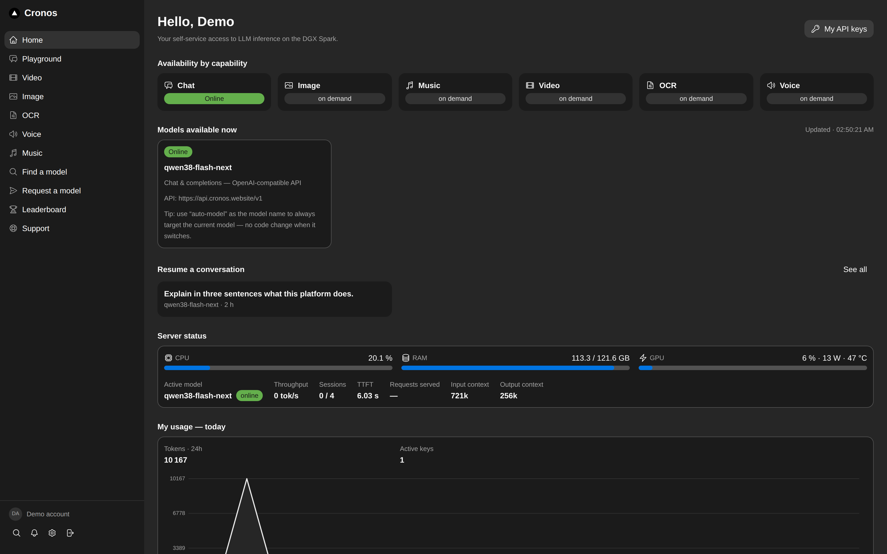
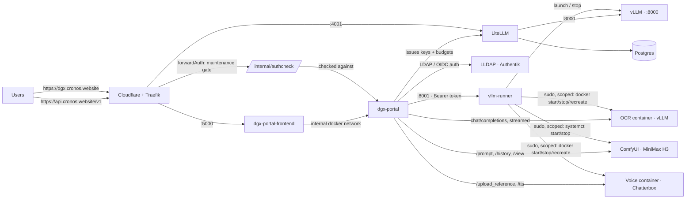
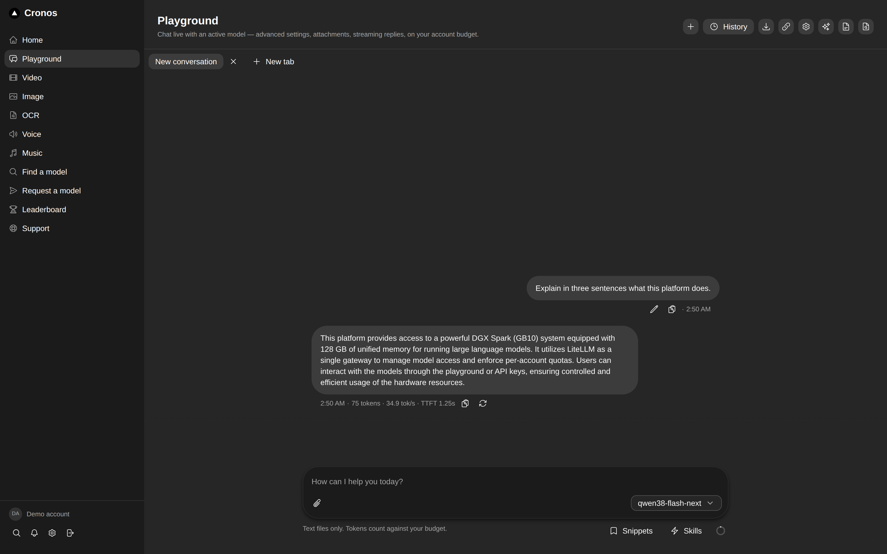
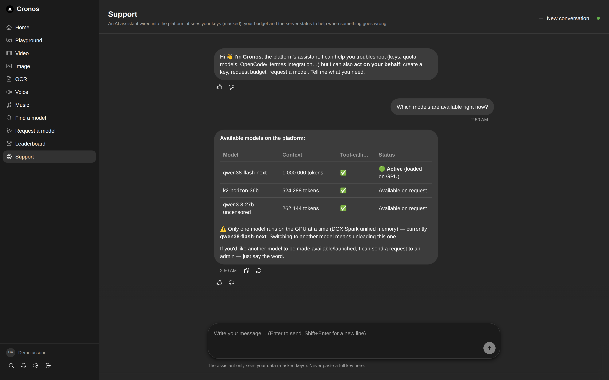
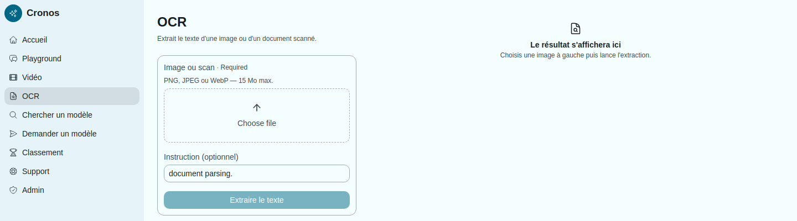
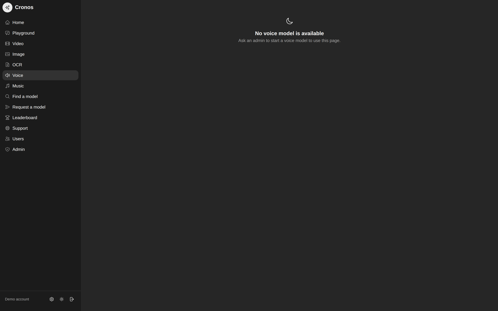
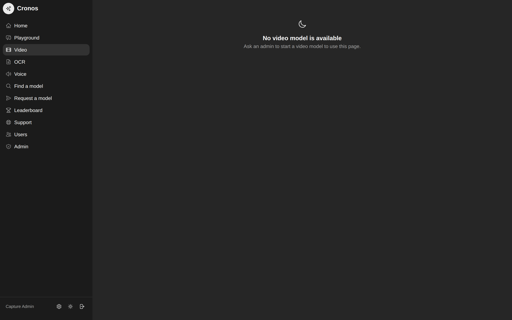
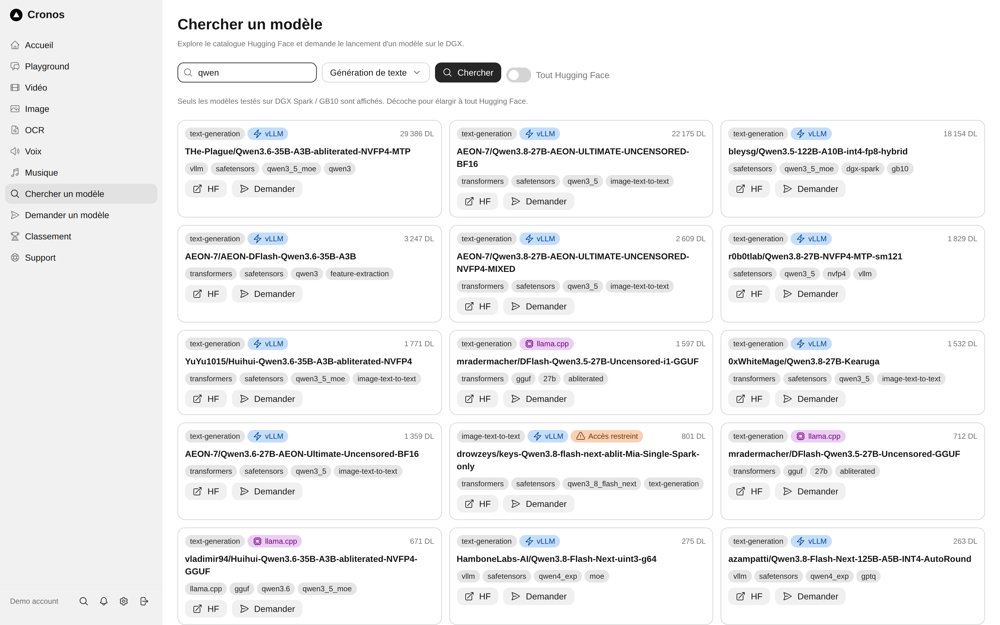
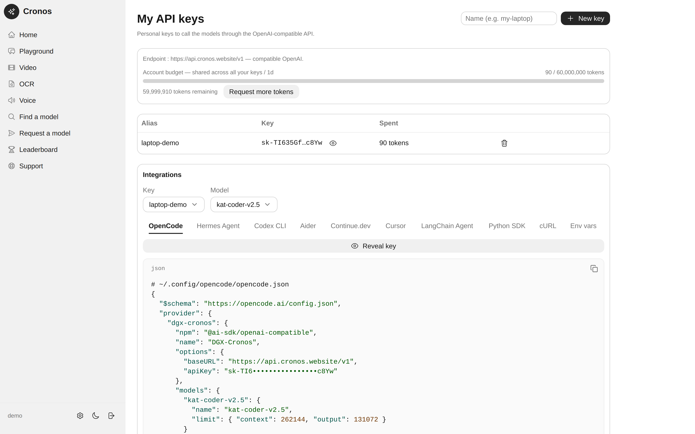
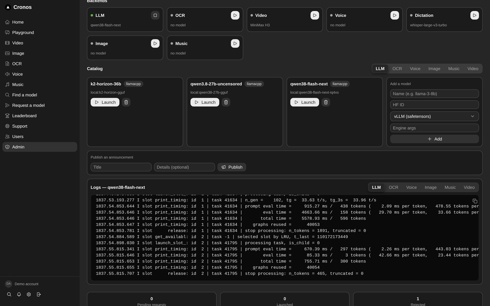

# Cronos — Self-Hosted LLM Platform

A self-hosted LLM inference platform running on a single **NVIDIA DGX Spark**
(GB10 Grace Blackwell, 128 GB unified memory, aarch64). It turns one GPU box into
a small multi-user AI service with an OpenAI-compatible API, per-user keys and
budgets, a self-service web portal, and an AI support assistant that can act on
your behalf.

It provides:

- an **OpenAI-compatible API** (LiteLLM) protected by per-user keys with token budgets;
- a **self-service portal** where each user (LDAP or SSO) creates keys, tries models
  in an in-browser **playground**, requests models, and tracks consumption;
- **Cronos**, an AI support assistant that answers questions *and* performs
  self-service actions (create a key, request budget, request a model…);
- a **runner** that launches/stops one vLLM model on the GPU on demand and
  auto-resumes it after a crash or reboot;
- always-on **OCR** (datalab-to/chandra-ocr-2 by default, swappable via an admin
  catalog), **video generation** (MiniMax H3, text-to-video and reference-image-to-video)
  and **voice cloning** (Chatterbox, zero-shot from a short reference sample)
  served from dedicated backends alongside the main chat model, streamed into
  the portal with a live bounding-box visualization of detected regions —
  never exposed as separate public UIs;
- an admin **maintenance mode** that blocks non-admin API/portal traffic without
  stopping any model, enforced both in the portal and at the edge (Traefik);
- a UI available in **English and French**, switchable per account from Settings
  → Appearance (English by default).



--- 

## Architecture


```mermaid
flowchart LR
  U[Users] -->|https://dgx.cronos.website| CF[Cloudflare + Traefik]
  U -->|https://api.cronos.website/v1| CF
  CF -->|forwardAuth: maintenance gate| AC[/internal/authcheck/]
  AC -->|checked against| P
  CF -->|:5000| F[dgx-portal-frontend]
  CF -->|:4001| L[LiteLLM]
  F -->|internal docker network| P[dgx-portal]
  P -->|LDAP / OIDC auth| IDP[LLDAP · Authentik]
  P -->|issues keys + budgets| L
  P -->|:8001 · Bearer token| R[vllm-runner]
  R -->|launch / stop| V[vLLM · :8000]
  R -->|sudo, scoped: docker start/stop/recreate| O[OCR container · vLLM]
  R -->|sudo, scoped: systemctl start/stop| CU[ComfyUI · MiniMax H3]
  R -->|sudo, scoped: docker start/stop/recreate| VC[Voice container · Chatterbox]
  L -->|:8000| V
  L --> PG[(Postgres)]
  P -->|chat/completions, streamed| O
  P -->|/prompt, /history, /view| CU
  P -->|/upload_reference, /tts| VC
```

### Components

| Component | Role | Port | Runs as |
|---|---|---|---|
| **litellm** | OpenAI-compatible gateway: per-user keys, budgets, token accounting | `4001` | Docker container |
| **litellm-postgres** | LiteLLM database (keys, spend logs) | `5432` (internal) | Docker container |
| **dgx-portal-frontend** | The UI (Next.js + Astryx): login, home, keys, playground, OCR, video, support, admin | `5000` | Docker container (non-root) |
| **dgx-portal** | Backend (Flask): LDAP/OIDC auth, sessions, JSON API, business logic | internal only | Docker container (non-root) |
| **vllm-runner** | Daemon driving **one** vLLM process (start/stop/logs) with auto-resume, plus scoped start/stop/recreate of the OCR container and video service | `8001` | systemd service on the host |
| **vLLM** | OpenAI-compatible inference server (the main chat engine) | `8000` | process spawned by the runner |
| **OCR container** | vLLM serving an OCR-capable VLM (datalab-to/chandra-ocr-2 by default; baidu/Unlimited-OCR also in the catalog), swappable via an admin catalog | internal only | Docker container, own network + GPU slice |
| **ComfyUI** | Video generation graph engine (MiniMax H3 in **NVFP4** — the Blackwell-native 4-bit format the GB10 supports; 12.5 GB per UNET instead of 21 GB for the INT8 build) | `8188`, host-restricted | systemd service on the host |
| **ASR container** | Whisper (`large-v3-turbo` by default) for Playground dictation | internal only | Docker container, own network + GPU slice |
| **Voice container** | Zero-shot voice cloning. Two interchangeable engines, swappable from the admin catalog: **Qwen3-TTS** (default, Apache 2.0, 10 languages, 3s cloning) or **Chatterbox** (MIT, Turbo/Original are English-only, Multilingual covers 23 languages) | internal only | Docker container, own network + GPU slice |

> Only one **chat** model runs on the GPU at a time (launching another replaces the current
> one) — OCR, video and voice are separate, always-addressable backends that run alongside
> it, each with their own GPU memory budget. On a single 128 GB unified-memory box that
> budget is genuinely shared: if a launch fails with an out-of-memory error, stop one of
> the sidecars from **Admin** rather than shrinking the chat model.

The UI used to be server-rendered Jinja templates served directly by Flask on
`:5000`. It's now a separate Next.js/Astryx frontend that owns `:5000` and
talks to Flask over the internal docker network for everything — auth, data,
and even the streaming chat endpoints (proxied through dedicated Next.js
Route Handlers so token-by-token streaming isn't buffered). Flask itself no
longer has a published port. The old templates are gone; reverting would mean
restoring them from git history and swapping the two services' ports back in
`docker-compose.yml`.

---

## Quick start

Prerequisites: a DGX Spark (or any CUDA host), a reachable LLDAP server, and outbound
internet for pulling images and model weights.

```bash
# One-shot bootstrap: installs Docker, Python/pipx, vLLM, clones the repo,
# generates .env, installs the systemd units and brings the stack up.
curl -fsSL https://raw.githubusercontent.com/Sunderrrr/dgx-spark-llm-platform/master/install.sh | sudo bash
```

Or manually:

```bash
git clone https://github.com/Sunderrrr/dgx-spark-llm-platform.git
cd dgx-spark-llm-platform
sudo ./install.sh          # installs packages + systemd units, generates .env
#   → then fill the remaining secrets in .env (LDAP/OIDC/SMTP/Discord)
docker compose up -d       # frontend + backend + gateway + database
```

Then open the portal (`http://<host>:5000`, or your HTTPS domain behind Traefik),
go to **Admin**, and launch a model from the catalog.

---

## Configuration (`.env`)

`docker-compose.yml` injects these into `dgx-portal` / `litellm`. `install.sh`
(via `setup.sh`) generates the random secrets; fill in the rest. See `.env.example`.

| Variable | Purpose |
|---|---|
| `WEBUI_SECRET_KEY` | Flask session signing key |
| `LITELLM_MASTER_KEY` | LiteLLM master key (gateway admin) |
| `POSTGRES_PASSWORD` | LiteLLM database password |
| `LLDAP_ADMIN_PASSWORD` | LDAP bind (user/group lookup, notification emails) |
| `RUNNER_TOKEN` | Bearer token between `dgx-portal` and `vllm-runner` (also used for the OCR/video sidecar control routes) |
| `OCR_URL` | Internal URL of the OCR vLLM container (default `http://ocr:8000/v1`) |
| `VOICE_URL` | Internal URL of the Chatterbox voice container (default `http://voice:8004`) |
| `ASR_URL` | Internal URL of the Whisper transcription container (default `http://asr:8006`) |
| `COMFYUI_URL` | Internal URL of the ComfyUI video backend (default `http://host.docker.internal:8188`) |
| `PUBLIC_API_URL` | Public API URL shown to users (default `https://api.cronos.website/v1`) |
| `OIDC_CLIENT_ID` / `OIDC_CLIENT_SECRET` | Authentik `dgx-spark` OIDC app |
| `OIDC_METADATA_URL` / `OIDC_REDIRECT_URI` / `OIDC_LOGOUT_URL` | OIDC endpoints |
| `OIDC_ADMIN_GROUP` | Group granting the admin role (default `adm_cronos`) |
| `SESSION_COOKIE_SECURE` | `1` behind an HTTPS proxy (Traefik), `0` for plain-HTTP LAN |
| `KEY_MAX_BUDGET` / `KEY_BUDGET_DURATION` | Default per-account budget |
| `DISCORD_WEBHOOK_URL`, `SMTP_*`, `ADMIN_EMAIL` | Request notifications |

> `.env` is **gitignored** — no secret is committed. `.env.example` holds only placeholders.
>
> The UI (`dgx-portal-frontend`) supports **English and French**, toggled
> from Settings → Appearance; English is the default. `docker-compose.yml`
> reads `BACKEND_URL` to reach Flask internally; the default
> (`http://dgx-portal:5000`) matches the compose service name and rarely
> needs changing.

---

## Authentication

Two methods, handled by `dgx-portal`:

- **OIDC SSO (Authentik)** — primary. "Sign in with Cronos SSO". Flow:
  `/login/sso` → Authentik → `/api/oauth2-redirect`. Admin comes from the `groups`
  claim (`adm_cronos`), falling back to an LDAP lookup by username if absent.
- **LDAP (LLDAP)** — username/password fallback: direct bind, injection-escaped,
  empty-password binds rejected, with in-memory brute-force lockout (6 fails / 15 min).

Session hardening: `HttpOnly` + `SameSite=Lax` cookies + `Secure` behind TLS.
`ProxyFix` trusts Traefik's `X-Forwarded-*` headers.

---

## Token budget model

Budgets are enforced **per account** (a LiteLLM *user*), shared across all of that
user's keys — creating extra keys does not raise the cap. Weighted in
`litellm/config.yaml`:

- `output_cost_per_token: 1` → 1 generated token = 1 budget unit;
- `input_cost_per_token: 0.1` → prompt tokens count **10× less**.

Default: **60,000,000 weighted tokens/day** per account (editable in
**Admin → token limit**, no restart). Admins are uncapped. Over budget → HTTP
`429 budget_exceeded`. The portal shows a banner once an account passes 85%.

---

## Using the API

OpenAI-compatible endpoint: **`https://api.cronos.website/v1`**. Every call needs a
key issued from the portal (`Authorization: Bearer sk-…`).

```bash
curl https://api.cronos.website/v1/chat/completions \
  -H "Authorization: Bearer sk-your-key" \
  -H "Content-Type: application/json" \
  -d '{"model":"ornith-35b-fp8","messages":[{"role":"user","content":"Hello!"}]}'
```

The **My API keys** page generates ready-to-paste snippets for OpenCode, Hermes
Agent, Codex CLI, Aider, Continue.dev, Cursor, LangChain, the Python SDK, cURL and
env vars — key and endpoint pre-filled.

> For **OpenCode**, the config uses a dedicated `dgx-cronos` provider (not `openai`)
> so it won't clash with an official OpenAI account.

---

## Portal features

- **My API keys** — create/revoke keys, see per-key spend and the shared account
  budget, request more tokens; integration snippets per tool.
- **Playground** — in-browser streaming chat with the active model; no client setup.
  Includes **dictation**: a mic button transcribes what you say into the composer.
  Deliberately self-hosted (Whisper on the GPU) rather than the browser's
  `SpeechRecognition` API, which in Chrome ships the audio to Google's servers —
  the opposite of the point of this platform. The button only appears when the
  transcription backend is running.
- **OCR** — extract text from an image/scan, streamed token-by-token into a
  formatted panel (same pattern as the Playground), with a toggle to visualize
  every detected region as bounding boxes over the source image; keeps your
  last 20 results, including the analyzed image itself.
- **Video** — turn a text description, with or without a reference image, into
  a short video with synced audio (MiniMax H3), polled to completion; keeps
  your last 3 results.
- **Voice** — **record a sample straight from your microphone** (1 minute max,
  auto-stops, with playback before you commit) or upload one (WAV/MP3), give it
  any text, and get that text read back in that voice — zero-shot, no
  fine-tuning, a few seconds per generation; keeps your last 20 results with
  in-page playback. The page adapts to whichever engine is loaded: it only
  shows the language selector when the engine speaks more than one, and only
  offers the optional **reference transcript** (which noticeably improves
  likeness) on Qwen3-TTS, which is the only one that uses it. Browser
  recordings are converted to 24 kHz mono WAV client-side
  (`lib/audioRecorder.ts`) because `MediaRecorder` only emits WebM/Opus, which
  neither model accepts. Samples shorter than ~6 s are rejected client-side —
  both engines need a few seconds of speech, Chatterbox strictly more than 5.
  OCR, video and voice all show a clear empty state if no backend is currently
  running, instead of letting you submit into a dead end.
- **Support (Cronos)** — an AI assistant that sees your keys (masked), budget, the
  model catalog and server status, and can **act for you**: create a key, revoke one,
  request budget, request a model (admins also get launch/stop). Actions are always
  scoped server-side to the logged-in user; impactful ones require in-chat confirmation.
- **Find a model** (`/search`) — live search over the Hugging Face Hub (no local
  cache), filterable by task including text/image/video generation, defaulting
  to models tagged as tested on GB10; paginated ("Load more") rather than
  capped at the first page.
- **Leaderboard** (`/ranking`) — ranks users by weighted spend (day/week/month),
  colorblind-safe palette, from LiteLLM's Postgres spend logs.
- **Home** — live server stats (CPU/RAM/GPU), active-model health (tok/s, queue,
  TTFT, requests served), your own hourly usage chart, and every currently-running
  backend (chat, OCR, video, voice) — the sidecars are clearly marked "not exposed
  by the API".
- **Admin** (`adm_cronos` only) — launch/stop models, live vLLM logs, add/edit/remove
  catalog models (chat, OCR **and** voice), start/stop the OCR container, the video
  service and the voice container independently of the chat model, set the default
  budget, approve token/model requests, per-user consumption **and** per-user
  OCR/video/voice usage (untracked by LiteLLM since none of them go through a public
  API key), and a **maintenance mode** toggle that blocks non-admin traffic everywhere
  (portal chat/OCR/video/voice *and* the public API) without stopping any backend.

### Screenshots

| Playground — in-browser streaming chat (with dictation) | Support — the Cronos assistant, budget- and status-aware |
|---|---|
|  |  |

| OCR — text extracted live from a scanned document | Voice cloning — zero-shot from a short sample (Qwen3-TTS) |
|---|---|
|  |  |

| Video generation — text- or image-driven, MiniMax H3 | Find a model — Hugging Face catalog search |
|---|---|
|  |  |





---

## Operations

### Launch a model

Via the portal (**Admin → Launch**) or the runner API directly:

```bash
curl -H "Authorization: Bearer $RUNNER_TOKEN" -H "Content-Type: application/json" \
  -d '{"hf_model_id":"deepreinforce-ai/Ornith-1.0-35B-FP8","model_name":"ornith-35b-fp8",
       "vllm_args":"--enable-auto-tool-choice --tool-call-parser qwen3_coder --dtype bfloat16 --max-model-len 262144 --gpu-memory-utilization 0.7 --max-num-seqs 8"}' \
  http://127.0.0.1:8001/launch
```

### Auto-resume

The runner persists the last successful launch (`/var/lib/vllm-runner/last_model.json`)
and **relaunches it** after a process crash, a service restart or a reboot. A manual
`/stop` clears that state (no resume). Capped at 3 consecutive attempts.

### systemd services

| Unit | Role |
|---|---|
| `vllm-runner.service` | The runner daemon (non-root `vllmrunner` user) |
| `vllm-restrict.service` | iptables: host ports **8000**/**8001** limited to localhost + Docker bridge |
| `cronos-docker-restrict.service` | DOCKER-USER rules: **4001** to LAN+VPN, **5000** to Traefik only |

---

## Security

- **LiteLLM API (4001)**: no request without a valid key (`401`), budgets enforced
  (`429`). Restricted by firewall to the LAN + VPN; the intended public surface is
  via Traefik.
- **vLLM (8000) and runner (8001)**: firewalled to localhost + Docker bridge. The
  runner also requires a **Bearer token** and **allowlists** `vllm_args` (blocks
  `--trust-remote-code` and overriding critical flags), and runs **non-root**.
- **Portal**: LDAP/SSO auth, hardened cookies, per-request nonce CSP on
  `script-src` (`dgx-portal-frontend/proxy.ts`), security headers, non-root
  containers with dropped capabilities on both `dgx-portal` and
  `dgx-portal-frontend`, IDOR / open-redirect / LDAP-injection guards, login
  brute-force lockout. `dgx-portal` itself has no published port — only
  `dgx-portal-frontend` is reachable from outside the docker network, and it
  only ever talks to Flask over that internal network.
- **Published ports** are filtered in `DOCKER-USER`: `4001` (API) reachable from the
  LAN and the Netbird VPN, `5000` (frontend) from Traefik only (HTTPS).
- **OCR / video / voice control**: no `docker.sock` is mounted anywhere — `vllm-runner`
  (already a trusted, HMAC-token-gated host daemon) gets narrowly scoped `sudo`
  rights (`/etc/sudoers.d/vllmrunner-services`) to `systemctl start/stop` the
  video service and `docker start/stop/inspect` the OCR container, plus one
  wildcard-argument rule limited to a single root-owned wrapper script
  (`/usr/local/sbin/ocr-recreate.sh`) that recreates the OCR container from a
  fixed image/network/mount template — the admin only controls the trailing
  vLLM argv, allowlisted the same way as the main model catalog (with
  `--trust-remote-code` deliberately allowed for this one container, since the
  OCR models that need it require it — an admin-only tradeoff, not available
  anywhere else). The OCR container lives on its own docker network
  (`ocr_net`, shared only with `dgx-portal`) rather than the shared
  `ai-platform_default` network — arbitrary code from a malicious HF repo run
  there has no L3 route to `litellm`, `litellm-postgres`, or `traefik`.
  The **voice** container follows the same pattern: its own `voice_net`, its own
  `docker start/stop/inspect` sudo rules, and a root-owned
  `/usr/local/sbin/voice-recreate.sh` wrapper. Its one variable argument
  (`repo_id`) is checked against a **closed allowlist** of the three Chatterbox
  variants in both `runner.py` and the script itself — there is no free-form
  argv here at all, unlike the OCR container.
- **Maintenance mode**: a DB flag, enforced twice. Inside the portal,
  chat/OCR/video/voice routes check it directly and let admins through. For the public API
  (`api.cronos.website`), a Traefik `forwardAuth` middleware calls an internal,
  unauthenticated `/internal/authcheck` route on every request; it's a cheap no-op
  (immediate 200, no lookup) whenever maintenance mode is off, and when it's on it
  resolves the caller's API key to an account and only lets admin accounts through
  — everyone else gets Traefik's relayed 503 before the request ever reaches LiteLLM.
- **Abuse & resource limits** (hardened after a multi-agent security review):
  - GPU-heavy media routes (`/api/video/generate`, `/api/ocr/extract`,
    `/api/voice/generate`) are rate-limited per account — none go through a
    LiteLLM key, so token budgets don't cap them; a per-user sliding window does.
  - Flask enforces `MAX_CONTENT_LENGTH` (16 MB) so an unauthenticated POST can't
    stream gigabytes onto disk before the CSRF/auth checks run.
  - The voice/ASR sidecars read the **audio header before decoding** (rejecting
    out-of-range duration / sample-rate / channel counts) so a tiny crafted FLAC
    can't decompress into tens of GB and trip the OOM killer on the shared
    unified-memory pool; decoding and resampling run off the event loop, TTS text
    and chunk length are hard-bounded, and generation runs under a GPU lock with
    a wall-clock timeout.
  - `Cf-Connecting-Ip` / `X-Forwarded-For` are validated as real IPs before being
    trusted as a login-lockout key, and the Flask CSP served on proxied responses
    was tightened to `script-src 'self'` (the old Jinja UI it loosened for is gone).

### Exposing the API publicly

Path: `api.cronos.website` (**Cloudflare, proxied**) → **Traefik** →
`http://dgx.cronos.lan:4001` (LiteLLM, internal HTTP — TLS terminated at the proxy).
Only route to `4001`, never `8000`/`8001`. Consider a per-key rate limit (rpm/tpm) in
LiteLLM and a Cloudflare rate rule before opening to the internet — budgets cap
tokens/day, not request rate on a single GPU.

---

## Repository layout

```
.
├── install.sh                # one-shot host bootstrap (packages + systemd + .env)
├── setup.sh                  # generates .env with random secrets
├── docker-compose.yml        # postgres + litellm + dgx-portal + dgx-portal-frontend
├── .env.example              # placeholders (no real secrets)
├── litellm/
│   └── config.yaml           # models, token pricing, model_info
├── dgx-portal/                # Flask backend: auth + JSON API + business logic
│   ├── app.py                 # LDAP+OIDC auth, /api/*, budgets, support, admin,
│   │                          #   OCR/video proxying, maintenance mode
│   ├── workflows/              # ComfyUI API-format workflow templates (video)
│   ├── requirements.txt
│   └── Dockerfile             # non-root image, no published port
├── dgx-portal-frontend/       # Next.js + Astryx UI (owns the public port 5000)
│   ├── app/                   # pages (home, playground, ocr, video, keys, support, admin, ...)
│   │   ├── playground/chat/route.ts   # streaming proxy to Flask (SSE, unbuffered)
│   │   └── support/chat/route.ts      # same, for the support assistant
│   ├── lib/                   # api.ts (auth/CSRF/SSE helpers), types, conversations
│   ├── proxy.ts                # Next.js 16 proxy: nonce CSP + method-based routing
│   ├── next.config.ts          # CSP headers, fallback rewrite to Flask
│   └── Dockerfile
├── voice/                     # Chatterbox voice-cloning sidecar (fallback engine)
│   ├── Dockerfile             # pinned upstream release, CUDA 13.0 / sm_121 (GB10)
│   ├── entrypoint.sh          # server + periodic purge of uploaded reference clips
│   └── voice-recreate.sh      # source of /usr/local/sbin/voice-recreate.sh (installed on the host)
├── asr/                       # Whisper transcription sidecar (Playground dictation)
│   ├── Dockerfile             # same CUDA 13.0 / sm_121 base as the voice sidecars
│   ├── server.py              # minimal HTTP wrapper (transformers pipeline)
│   └── asr-recreate.sh        # source of /usr/local/sbin/asr-recreate.sh
├── voice-qwen/                # Qwen3-TTS voice-cloning sidecar (default engine)
│   ├── Dockerfile             # same CUDA 13.0 / sm_121 base; no flash-attn on aarch64
│   ├── server.py              # minimal HTTP wrapper — upstream ships no server
│   │                          #   (vLLM-Omni is offline-inference only so far)
│   └── voice-qwen-recreate.sh # source of /usr/local/sbin/voice-qwen-recreate.sh
├── vllm-runner/
│   └── runner.py              # start/stop/logs daemon + auto-resume;
│                               #   scoped sudo control of the OCR + voice containers and video service
└── systemd/                   # host units (runner, firewalls, comfyui)
```

> `/usr/local/sbin/ocr-recreate.sh`, `/usr/local/sbin/voice-recreate.sh` and
> `/etc/sudoers.d/vllmrunner-services` live outside this repo (host-level,
> root-owned) — see the OCR/video/voice control note under **Security** above.
> `voice/voice-recreate.sh` is the tracked copy; install it with
> `install -o root -g root -m 0755 voice/voice-recreate.sh /usr/local/sbin/`.

## License

Licensed under MIT.
