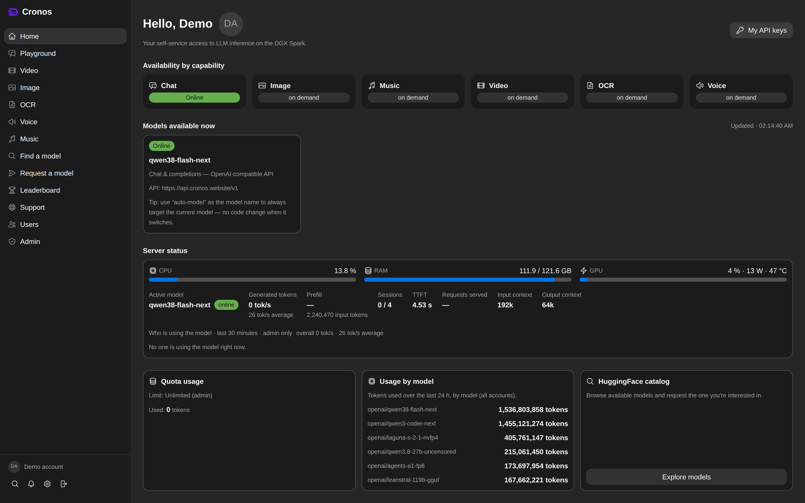

# Self-Hosted LLM Platform

[](https://github.com/Sunderrrr/dgx-spark-llm-platform/actions/workflows/ci.yml)
[](https://github.com/Sunderrrr/dgx-spark-llm-platform/releases)
[](LICENSE)
[](CHANGELOG.md)

A self-hosted LLM platform running on a single **NVIDIA DGX Spark** (GB10 Grace
Blackwell, 128 GB unified memory, aarch64): one GPU box, many users, production.
It turns the machine into a small multi-user AI service — an OpenAI-compatible
API with per-user keys and budgets, a self-service web portal whose UI is
**French-first** (English available per account), and a Support assistant that
can act on your behalf.



## What it does for a user

- **Chat + reasoning** — streaming playground with adaptive thinking (visible
  collapsible reasoning), attachments, a live document panel, dictation.
- **Image, video, OCR, voice, music** — generated from dedicated pages *and*
  callable by the model as tools; each service is an on-demand sidecar that says
  so when it isn't loaded instead of failing.
- **Web search** — on explicit request: SearXNG finds the links, crawl4ai reads
  the pages, every step shown live.
- **Skills** — `/summarize`, `/code`, `/email`, `/slides`… prepared prompts that
  shape the model, plus your own.
- **Conversations** — history, pinning, sharing by read-only link, export as
  Markdown, and a personal knowledge-graph memory you can switch off.
- **API keys** — per-user keys with token budgets, a virtual **`auto-model`**
  that follows whatever chat model is loaded, and ready-to-paste snippets for
  Claude Code, Codex, Cursor, the Python SDK, cURL…
- **The Support assistant** — answers questions and acts on your account
  (create/revoke a key, request budget, request a model), with a confirmation
  button for anything impactful.
- **Find or request a model** — live Hugging Face search with GB10-tested badges,
  admin-launched catalog, and a form to ask for a model or more tokens.
- **Accounts and quotas** — sign in with SSO, LDAP or a local account (optional
  passkey 2FA); per-account token budgets, groups, blocking, and self-service
  session and password management.
- **See what is happening** — a home dashboard with the running backends, live
  server state (throughput, sessions, TTFT) and your own token usage, plus a
  spend leaderboard.

## How it works

The UI is a **Next.js shell** (`dgx-portal-frontend`, port 5000) talking to a
**Flask portal** (`dgx-portal`, no published port) over the internal docker
network. The portal owns authentication (LDAP/OIDC, sessions, per-request account
checks) and business logic; it issues per-user keys and budgets to **LiteLLM**,
the OpenAI-compatible gateway that serves the public API
(`https://api.cronos.website/v1`) through Cloudflare and Traefik — LiteLLM
publishes no host port at all — and keeps keys and spend logs in **PostgreSQL**.
On the GPU, a systemd daemon (`vllm-runner`) starts and stops **one chat model**
at a time (vLLM, llama.cpp, ds4 or exllamav3) and auto-resumes it after a crash
or reboot. OCR, video, image, music, voice and dictation run in **on-demand
sidecars**, each on its own network: one 128 GB GPU cannot hold the chat model
and several media models at once, so they start at first use and leave memory
when idle. Full diagram, components and module map: [docs/architecture.md](docs/architecture.md).

## How to deploy it

Prerequisites: a DGX Spark (or any CUDA host), a reachable LDAP directory plus an
OIDC provider, and outbound internet for pulling images and model weights.

One-shot bootstrap — installs Docker, Python/pipx, vLLM, clones the repo,
generates `.env`, installs the systemd units + firewall rules + media sidecar
wrappers, then prints the next steps (it does not start the stack itself):

```bash
curl -fsSL https://raw.githubusercontent.com/Sunderrrr/dgx-spark-llm-platform/master/install.sh | sudo bash
```

Or manually:

```bash
git clone https://github.com/Sunderrrr/dgx-spark-llm-platform.git
cd dgx-spark-llm-platform
sudo ./install.sh        # packages + systemd units + a generated .env
#   → fill the remaining secrets in .env (LDAP/OIDC/SMTP/Discord)
docker compose up -d     # frontend + backend + gateway + database
./scripts/deploy.sh      # build + replace + verify the running service
```

Then open the portal (`http://<host>:5000`, or your HTTPS domain behind Traefik),
go to **Admin**, and launch a model from the catalog. The detailed guide
(upgrades, host state, shipping a change to a running box):
[docs/deployment.md](docs/deployment.md). The keys to fill in:
[docs/configuration.md](docs/configuration.md).

## How to validate a change

```bash
./scripts/valider.sh     # run after EVERY modification
```

One command, four groups: code gates (724 backend tests, frontend, types, lint,
i18n, secret scan), the **running** service, 14 user journeys (login/SSO, chat,
reasoning, image, web search, skills, conversations, export, admin, API keys,
page sweep, page actions, security) with route coverage of 158 routes, and
health. Safe to run at any moment (no destructive action), time-bounded, 7–8
minutes. A green test suite and a broken service have cohabited twice — this is
the gate that catches it. Details and the engineering loop:
[docs/development.md](docs/development.md).

## Documentation map

| Document | What it holds |
|---|---|
| [docs/architecture.md](docs/architecture.md) | request path, components, repository layout, backend module map |
| [docs/deployment.md](docs/deployment.md) | install, first launch, shipping a change to a running box |
| [docs/configuration.md](docs/configuration.md) | `.env` keys, the token budget model, the Admin configuration tab |
| [docs/authentication.md](docs/authentication.md) | SSO, LDAP, local accounts, blocking, deletion, sessions |
| [docs/features.md](docs/features.md) | every portal page: playground, media, Support, admin, users |
| [docs/api.md](docs/api.md) | endpoint, `auto-model`, integration snippets, request contract |
| [docs/operations.md](docs/operations.md) | model launch, auto-resume, engines, sidecars, systemd, monitoring |
| [docs/security.md](docs/security.md) | posture, accepted risks, the pen test — points to `SECURITY.md` |
| [docs/development.md](docs/development.md) | engineering loop, tests, `valider.sh`, conventions, screenshots, versioning |
| [docs/troubleshooting.md](docs/troubleshooting.md) | the known traps: GB10 memory, docker networking, the runner |

Companion documents: [SECURITY.md](SECURITY.md) · [CHANGELOG.md](CHANGELOG.md) ·
[CONTRIBUTING.md](CONTRIBUTING.md) · [CODE_OF_CONDUCT.md](CODE_OF_CONDUCT.md).
An operating guide named `CLAUDE.md` is kept on the machine and deliberately not
published (git-ignored): links to it point at a file that exists in a checkout on
the box.

License: MIT — see [LICENSE](LICENSE).
