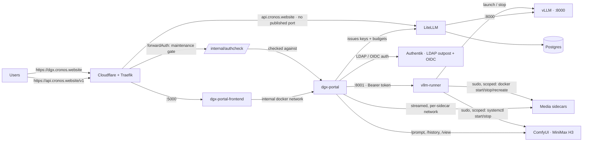

# Architecture

How the platform is wired: the request path, the components, and the shape of
the code. For how to run it, see [deployment](deployment.md); for the
day-to-day runbook, [operations](operations.md).

## Request path



> **The backend is modular.** `dgx-portal` is not one big Flask file: it is a
> shared core (config, database, auth, guards), a set of clients for everything
> it talks to (LiteLLM, vLLM, ComfyUI, the sidecars, MCP, web search), and one
> route blueprint per feature. [`app.py`](../dgx-portal/app.py) is a wiring facade —
> it builds the Flask app, registers the blueprints and boots the schema. See
> [Repository layout](#repository-layout).

### Components

| Component | Role | Port | Runs as |
|---|---|---|---|
| **litellm** | OpenAI-compatible gateway: per-user keys, budgets, token accounting | `4001` | Docker container |
| **litellm-postgres** | LiteLLM database (keys, spend logs) | `5432` (internal) | Docker container |
| **dgx-portal-frontend** | The UI (Next.js + Astryx): login, home, playground, media pages, support, find-a-model, leaderboard, admin, users (keys and memory live in the Settings dialog) | `5000` | Docker container (non-root) |
| **dgx-portal** | Backend (Flask): LDAP/OIDC auth, sessions, JSON API, business logic | internal only | Docker container (non-root) |
| **vllm-runner** | Daemon driving **one** chat model process (start/stop/logs; engines `vllm` / `llamacpp` / `ds4`) with auto-resume, plus scoped start/stop/recreate of every media sidecar | `8001` | systemd service on the host |
| **vLLM** | OpenAI-compatible inference server (the main chat engine) | `8000` | process spawned by the runner |
| **OCR container** | vLLM serving an OCR-capable VLM (baidu/Unlimited-OCR by default, chandra-ocr-2 also supported), swappable via an admin catalog | internal only | Docker container, own network + GPU slice |
| **ComfyUI** | Video generation graph engine (MiniMax H3 in **NVFP4** — the Blackwell-native 4-bit format the GB10 supports; measured on disk: 11.7 GiB ≈ 12.5 GB per UNET, two UNET variants) | `8188`, host-restricted | systemd service on the host |
| **Image container** | Text-to-image (diffusers). FLUX.2 Klein 4B by default, 35 diffusion steps per image (`IMAGE_STEPS`) | internal only | Docker container, own network + GPU slice |
| **Music container** | Text-to-music (diffusers, MiniMax-Music3 & co) | internal only | Docker container, own network + GPU slice |
| **ASR container** | Whisper (`large-v3-turbo` by default) for Playground dictation | internal only | Docker container, own network + GPU slice |
| **Voice container** | Zero-shot voice cloning. Two interchangeable engines: **Qwen3-TTS** (default, Apache 2.0, 10 languages, 3 s cloning) or **Chatterbox** (MIT) | internal only | Docker container, own network + GPU slice |
| **SearXNG + crawl4ai** | Web search for the playground: SearXNG finds links, crawl4ai reads the pages | internal only | Docker containers, shared `web_net` |

> Only one **chat** model runs on the GPU at a time (launching another replaces the
> current one) — the media sidecars are separate, always-addressable backends running
> alongside it, each with its own GPU memory budget. On a single 128 GB unified-memory
> box that budget is genuinely shared: if a launch fails with an out-of-memory error,
> stop a sidecar from **Admin** rather than shrinking the chat model.

The UI used to be server-rendered Jinja templates served directly by Flask on
`:5000`. It's now a separate Next.js/Astryx frontend that owns `:5000` and
talks to Flask over the internal docker network for everything — auth, data,
and even the streaming chat endpoints (proxied through dedicated Next.js
Route Handlers so token-by-token streaming isn't buffered). Flask itself no
longer has a published port.

## Repository layout

```
.
├── install.sh                 # one-shot host bootstrap (packages + systemd + .env)
├── setup.sh                   # generates .env with random secrets
├── docker-compose.yml         # postgres + litellm + portal + frontend + search sidecars
├── .env.example               # placeholders (no real secrets)
├── README.md · SECURITY.md
├── litellm/config.yaml        # proxy, router and callback settings (the model
│                              #   catalog itself lives in the LiteLLM database)
├── dgx-portal/                # Flask backend — see the module map below
├── dgx-portal-frontend/       # Next.js + Astryx UI (owns the public port 5000)
├── vllm-runner/runner.py      # model lifecycle daemon + scoped sidecar control
├── monitoring/                # host monitors: health alerts + daily DB dumps (systemd timers)
├── needrestart/               # needrestart policy (keeps vllm-runner out of its restarts)
├── ocr/ · voice/ · voice-qwen/ · asr/ · image-gen/ · music/   # sidecar images and host wrappers
├── searxng/settings.yml.example  # web-search config template (setup.sh writes the real one)
└── systemd/                   # host units (runner, firewalls, ComfyUI, recreate scripts)
```

### Backend module map (`dgx-portal/`)

The backend was a single 7 200-line file; it is now a shared core, a set of
clients, and one blueprint per feature. [`app.py`](../dgx-portal/app.py) is a wiring
facade of ~1 500 lines: it creates the Flask app, sets security headers and the CSP,
keeps the handful of routes that other modules reach by name (`index`, `login`,
`logout`, the OAuth callbacks), registers every blueprint and boots the schema.

**Shared core** — imports nothing from the rest, so nothing can create a cycle:

| Module | Holds |
|---|---|
| [`config.py`](../dgx-portal/config.py) | every environment-derived constant, in one place |
| [`db.py`](../dgx-portal/db.py) | SQLite access, persisted settings, schema and migrations, the LiteLLM Postgres connector |
| [`auth.py`](../dgx-portal/auth.py) | `login_required` / `admin_required`, CSRF, LDAP, brute-force lockout, session lifetime |
| [`guards.py`](../dgx-portal/guards.py) | maintenance and rate-limit guards, shared SSE helpers, upload validation |

**Clients and adapters** — one module per thing the portal talks to:

| Module | Talks to |
|---|---|
| [`litellm_client.py`](../dgx-portal/litellm_client.py) | LiteLLM: keys, budgets, accounts, model registration |
| [`vllm_health.py`](../dgx-portal/vllm_health.py) | the engine: served models, health, throughput, context window, HF search |
| [`sidecars.py`](../dgx-portal/sidecars.py) | the runner: launch/stop/logs, and every sidecar readiness probe |
| [`comfyui_client.py`](../dgx-portal/comfyui_client.py) | ComfyUI, for video |
| [`mcp_client.py`](../dgx-portal/mcp_client.py) | user-configured MCP servers |
| [`websearch.py`](../dgx-portal/websearch.py) · [`websearch_tools.py`](../dgx-portal/websearch_tools.py) · [`image_tools.py`](../dgx-portal/image_tools.py) | SearXNG + crawl4ai, and the tool layers that expose web search and image generation to the model |
| [`litellm_inflight.py`](../dgx-portal/litellm_inflight.py) | loaded BY LiteLLM, not by the portal: the callback that records in-flight requests, which is the only way to attribute a running request to an account |
| [`notify.py`](../dgx-portal/notify.py) · [`discord_notify.py`](../dgx-portal/discord_notify.py) · [`announcements.py`](../dgx-portal/announcements.py) | mail, Discord webhook and DMs, platform announcements |
| [`stats.py`](../dgx-portal/stats.py) · [`local_users.py`](../dgx-portal/local_users.py) · [`user_lifecycle.py`](../dgx-portal/user_lifecycle.py) · [`support.py`](../dgx-portal/support.py) | consumption aggregates · local accounts · account offboarding (sessions, keys, envelope, data) · the Support assistant's tools |

**Route blueprints** — no `url_prefix`, so every path is unchanged:

| Module | Routes |
|---|---|
| [`chat_routes.py`](../dgx-portal/chat_routes.py) | `/playground/chat`, `/support/chat` — SSE streaming |
| [`admin_routes.py`](../dgx-portal/admin_routes.py) | `/admin/*` — models, sidecars, accounts, quotas, maintenance |
| [`conversation_routes.py`](../dgx-portal/conversation_routes.py) · [`settings_routes.py`](../dgx-portal/settings_routes.py) · [`memory_routes.py`](../dgx-portal/memory_routes.py) | history · user settings · memory graph |
| [`ocr_routes.py`](../dgx-portal/ocr_routes.py) · [`voice_routes.py`](../dgx-portal/voice_routes.py) · [`asr_routes.py`](../dgx-portal/asr_routes.py) | OCR · voice cloning · dictation |
| [`image_routes.py`](../dgx-portal/image_routes.py) · [`music_routes.py`](../dgx-portal/music_routes.py) · [`video_routes.py`](../dgx-portal/video_routes.py) | the generation pages |
| [`preview_routes.py`](../dgx-portal/preview_routes.py) · [`discord_routes.py`](../dgx-portal/discord_routes.py) | sandboxed HTML preview · Discord account linking |
| [`webauthn_routes.py`](../dgx-portal/webauthn_routes.py) | `/api/security/*` — passkey registration, login challenge, 2FA toggle |

Also under `dgx-portal/`: `workflows/` (ComfyUI API-format templates for video),
`tests/`, `requirements.txt` and a non-root `Dockerfile` with no published port.

### Frontend (`dgx-portal-frontend/`)

Next.js 16 + Astryx. `app/(app)/` holds the pages, `lib/` the data helpers and the
i18n dictionary, `proxy.ts` the per-request nonce CSP and method-based routing, and
`lib/sseProxy.ts` the streaming relay to Flask. It has its own `README.md` and
`AGENTS.md` — start there for UI work.

> The `/usr/local/sbin/*-recreate.sh` wrappers and `/etc/sudoers.d/vllmrunner-*`
> live on the host (root-owned). Their tracked sources are `ocr/ocr-recreate.sh`,
> `voice/voice-recreate.sh`, `asr/asr-recreate.sh`, `voice-qwen/voice-qwen-recreate.sh`,
> `systemd/image-recreate.sh` and `systemd/ocr-restrict.sh`; install with e.g.
> `install -o root -g root -m 0755 ocr/ocr-recreate.sh /usr/local/sbin/`.
