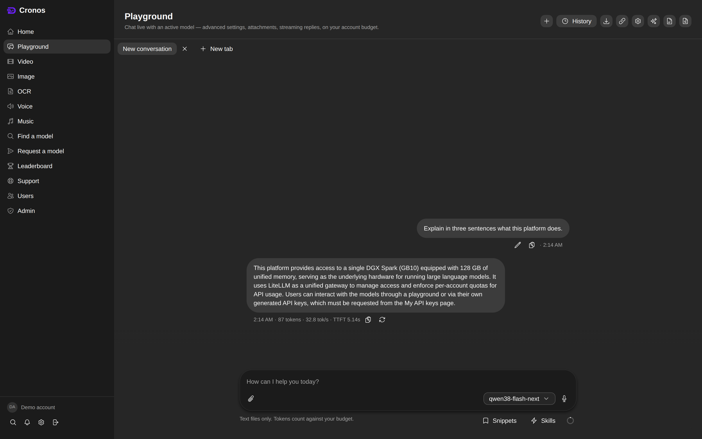
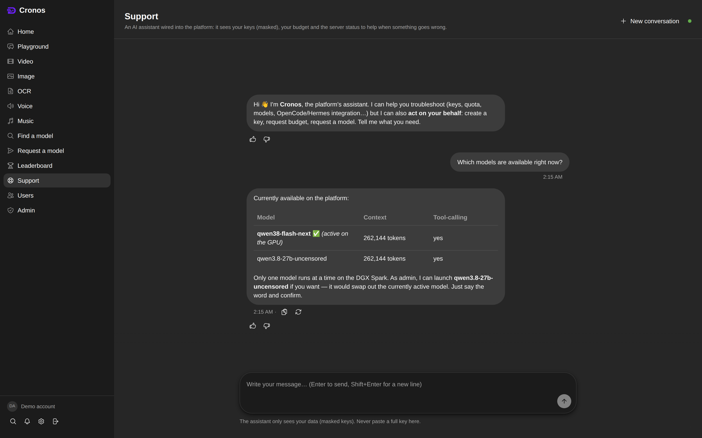
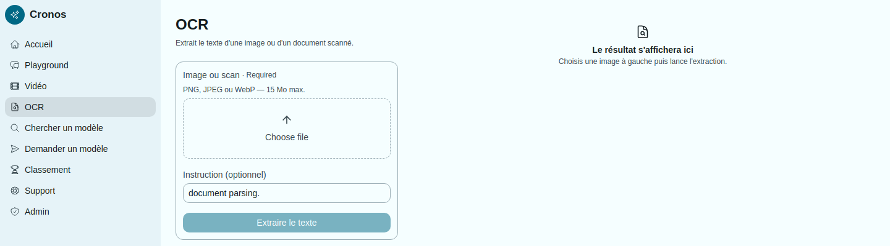
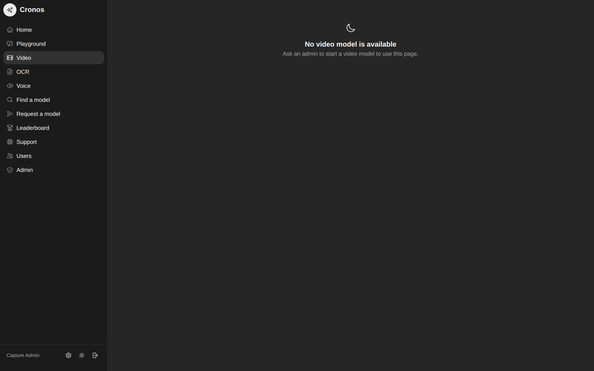
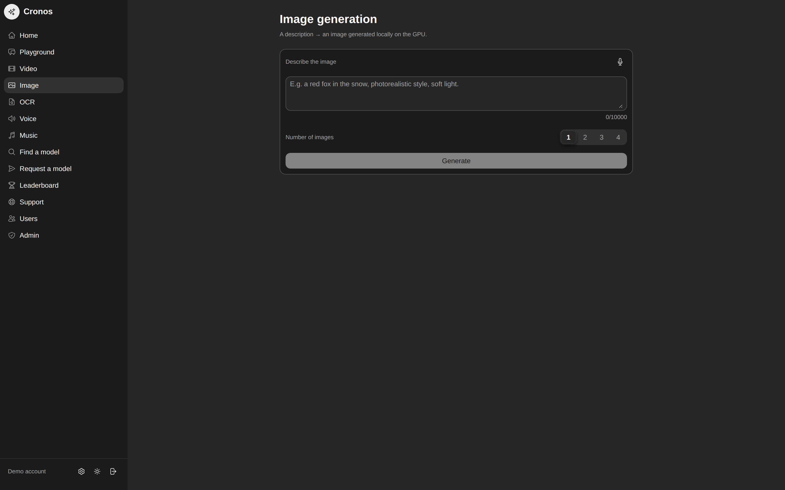
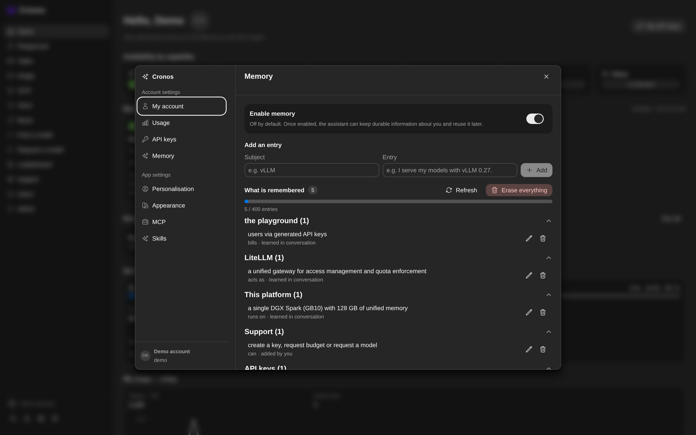
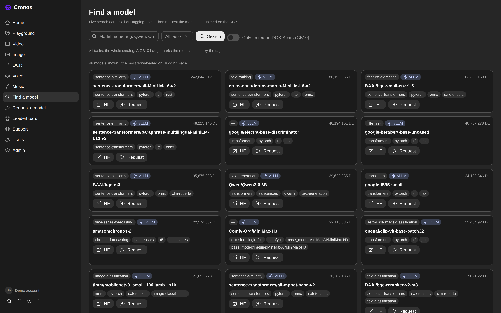
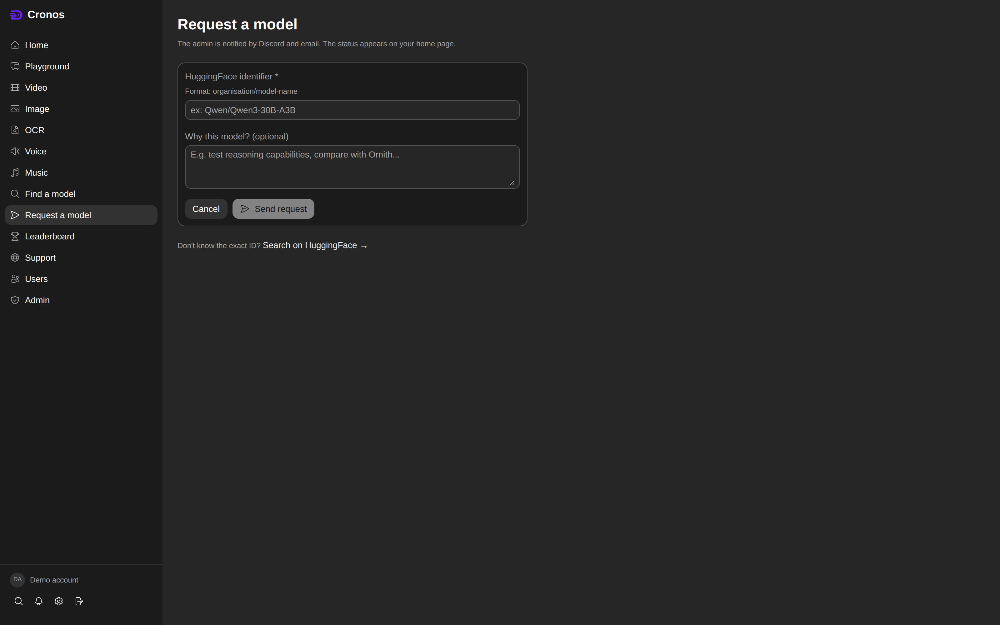
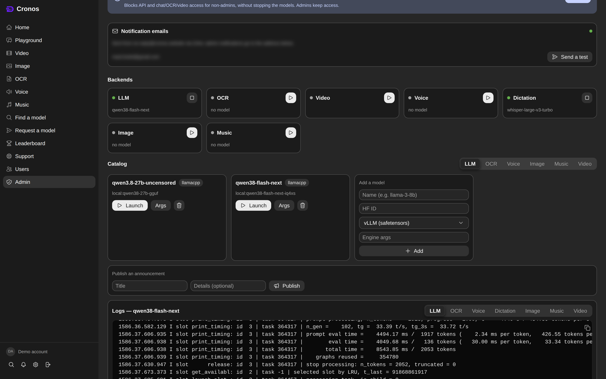

# Development

The engineering loop, the validation pipeline, the tests, and the conventions
that keep a live service alive while the code moves.

## The engineering loop

For any non-trivial change, work like a small, disciplined engineering team:
don't jump from request to code. Move through these phases and make each one
visible in what you write:

1. **Need** — state the actual problem in one or two sentences. What breaks, for
   whom, and how we'll know it's fixed. If the request is ambiguous, resolve it
   before designing.
2. **Options** — enumerate the real candidate solutions (usually 2–4), including
   "do nothing." One line each on the trade-off.
3. **Test the options** — when the choice isn't obvious, *prototype or benchmark*
   the top candidates cheaply before committing. On this box that often means a
   throwaway launch, a `curl`, or a tiny script — measure, don't guess.
4. **Choose** — pick one, say why in a sentence, and note what would make you
   revisit it.
5. **Implement** — build it to match the surrounding code (idiom, comment
   density, French-first UI strings). Small, reviewable commits.
6. **Document** — update the docs the change touches **only if it helps a future
   reader**. Don't document for its own sake.
7. **Verify & push** — run the pre-push gate (tests + secret scan). Green → push.
   Red → stop and report; never push around a red gate.

The loop is a default, not a ritual: a one-line fix doesn't need a formal options
table. Scale the ceremony to the risk.

## The validation pipeline — `./scripts/valider.sh`

**`./scripts/valider.sh` runs after EVERY modification**, before anything is
called done. It is the whole thing: code gates (724 backend tests, frontend,
types, lint, i18n, secret scan), the running service, 14 user journeys
(login/SSO, chat, reasoning, image, web search, skills, conversations, export,
admin, API keys, page sweep, page actions, security, route coverage of 158
routes), and health.

It exists because a green test suite and a broken service cohabited twice: once
when LiteLLM's entrypoint died on its own test while 724 tests passed, and once
when a refactor broke SSO while the code was clean. Both were found by a user,
not by the process. If a run fails, the fix is not « push anyway »: it is to fix,
or to say out loud what is broken and why it is acceptable. A run takes 7–8
minutes — that is the price of not being surprised.

Four groups, each with its own verdict:

1. **Code gates** — backend tests, frontend tests, typing, lint, i18n, secret
   scan (it reuses the existing scripts, no duplication).
2. **Service in operation** — `scripts/smoke.sh` against the DEPLOYED service.
3. **User journeys** — `tests/e2e/`: Playwright journeys that do what a user
   does (chat, reasoning, image, web search, skills, conversations, export,
   admin, API keys + API domain, pages, actions, security) plus the coverage of
   the 158 routes.
4. **Health & resources** — memory, served model, disk, backup.

Guarantees: safe to run **at any moment**, even while someone uses the platform
(no destructive action, no restart, no `--force-recreate`; journeys use only the
demo account and clean up after themselves); every check is time-bounded; a
failure speaks (« ✗ <check> » + the tail of the log + the full log path);
readable by a human AND by a git hook / CI (no TTY required, `NO_COLOR`
respected); non-zero exit if ANYTHING fails.

```bash
./scripts/valider.sh                       # everything
VALIDER_GROUPES=1,2 ./scripts/valider.sh   # only these groups
VALIDER_VERBEUX=1 ./scripts/valider.sh     # show the checks' output
```

Full logs stay in `runtime/validation/<timestamp>/`.

## Tests and the pre-push gate

- **Backend tests** run in a throwaway Docker image (never touches real data):
  `./dgx-portal/run-tests.sh` (all) or `./dgx-portal/run-tests.sh test_app`.
  `asr/server.py` is mounted READ-ONLY as `tests.asr_sidecar` (the script's "no
  volume" promise is "no DATA volume").
- **Frontend**: `cd dgx-portal-frontend && npm test` (the playground parser unit
  tests), `npx tsc --noEmit && npx eslint .` before committing UI changes.
  Recurring foot-guns: duplicate i18n keys (`TS1117`), invalid Astryx `Badge`
  variants, `wrap="wrap"` is a *string* not a boolean.
- **Pre-push gate**: `./scripts/pre-push-check.sh` — scans the diff for secrets,
  runs the test suite, then `scripts/check-i18n.py` (translations + frozen
  locales). **Green is required before any push.** It's also wired as a git
  `pre-push` hook. Run it with **`< /dev/null`**: as a hook it reads the ref lines
  from stdin, so with stdin left open it blocks forever on `read` instead of
  running anything.
- **CI** (`.github/workflows/ci.yml`) runs the backend tests + frontend
  `tsc --noEmit` + eslint on every push/PR. A green check is the merge bar.

Shell traps that cost real time:

- **`$HOME` can be EMPTY in an agent shell**, and then `git`/`gh` look in
  `/.config` instead of `/root` (symptom: `gh auth status` says "not logged in"
  and `git push` fails `could not read Username` **while the operator is logged
  in**, verified 2026-09-14). Fix: prefix with `HOME=/root`, or run
  `HOME=/root gh auth setup-git` once. The GitHub helper is scoped to the URL, so
  check `git config --get-all 'credential.https://github.com.helper'`.
- **`docker exec` heredoc gotcha**: `docker exec ... python3 - << 'PY'` produces
  no output in this harness. Write the script to a file, `docker cp` it in, run
  it. Manual edits to the portal data volume must be done **as the portal user
  (uid 10001)** — the container is hardened (`cap_drop ALL`, no-new-privileges),
  so even `docker exec -u 0` can't override file perms.
- **Test trap (cost two false diagnoses)**: the composer ALWAYS sends
  `ASK_INSTRUCTION` + `NAME_INSTRUCTION` + `INTEGRALITE_INSTRUCTION` in the
  `system`. A test calling `/playground/chat` with `system: ''` measures a
  different behaviour: file naming "does not work" while it does, and questions
  come out as a free list. Copy the frontend constants into the test's `system`,
  otherwise you fix what is not broken.
- Long-lived threads (budget reaper, ASR reaper, `suivi-lancement`) must stay
  behind the `CRONOS_NO_REAPER` seam — the suite sets it; a test must not depend
  on nobody else in the process making an HTTP call.

## Code conventions

- **i18n contract**: UI strings are **French-as-msgid**; English lives in
  `lib/i18n.tsx`. A missing EN key silently falls back to French. When you add a
  `t("…")` string, add its EN translation in the same commit. Don't add a
  duplicate key (TS error). Formatting follows the language, not just the text
  (`useLocale()` → `fr-FR` / `en-US`; in a helper outside a component the locale
  is a parameter). A displayed label is a French msgid — labels written in
  English in the code were untranslatable. `python3 scripts/check-i18n.py` (run
  by CI) fails on a `t("…")` without translation and on a frozen locale; it
  *reports* keys it never sees used (`t(variable)`), and that list holds false
  positives — **do not use it to delete keys**. Server messages are in French,
  including in English mode (the platform is FR-first); a stable refusal carries
  a `code` the UI translates, `error` is only a fallback.
- **The admin action contract**: every admin action answers JSON with an honest
  status — `{"ok": true}` (200) or `{"ok": false, "error": "phrase en français"}`
  with **400** (refusal), **404**, **409** (`needs_confirm`, or the "last admin"
  guard), **503** (upstream unreachable — never 502/504, Cloudflare replaces
  those bodies), **507** (memory), **403**. A `warning` accompanies a partial
  success, never instead of an error. **Doubt is not a failure**: a runner
  timeout gives **202** + `incertain: true` and **no infra alert** — alerting
  would make people click again, thus killing a model still loading. The contract
  holds for user routes too. `log_audit` must not be silent: a write failure goes
  to the error output.
- **Chat SSE errors are structured notices** (`cronos_notice` ids, FR msgids in
  `lib/notices.ts`, EN in `lib/i18n.tsx`): the server writes no sentence.
- **Conventions for commits and pull requests** are in
  [`CONTRIBUTING.md`](../CONTRIBUTING.md); participation is covered by the
  [Code of Conduct](../CODE_OF_CONDUCT.md).

## Screenshots

| Playground — streaming chat, dictation and web search | Support — the budget- and status-aware assistant |
|---|---|
|  |  |

| OCR — text extracted live from a scanned document | Video generation — text- or image-driven, MiniMax H3 |
|---|---|
|  |  |

| Image generation — FLUX.2 Klein | Memory — the knowledge graph the assistant keeps about you |
|---|---|
|  |  |

| Find a model — Hugging Face catalog search | Request a model |
|---|---|
|  |  |



> **Refreshing these screenshots** — nothing here is hand-made: the whole set is
> captured by `scripts/screenshots.py`, in **English** and in the **dark theme**,
> with the dedicated **`demo`** account (a plain, non-admin account created by
> `scripts/create-demo-account.py` — a screenshot must never expose a real
> person's dashboard). One command per step:
>
> ```bash
> python scripts/screenshots.py            # capture (1600×1000 at 2× → 3200×2000)
> python scripts/screenshots.py --verify   # size, dark theme, expected content, privacy
> python scripts/screenshots.py --install  # copy the fresh files into assets/
> ```
>
> Run them from the repository root. Beyond Python 3 they need `playwright`
> (plus `playwright install chromium`), `pillow` and `tesseract`, which `--verify`
> uses to read the text of each PNG.
>
> The verification is not decorative: it OCRs each final PNG and **fails** if an
> email address, an API key or another account's name is visible (private IPs are
> not searched for in the text — they are blurred *before* the capture, by the
> same pass that blurs the text, so they never reach the pixel grid at all).
> `/admin` carries the notification address near the top and the per-user budget
> requests further down, so that page is captured at a fixed scroll position —
> and `/admin`, like `/users`, needs `is_admin` granted to the demo account for
> the few minutes of the shoot (the script refuses and deletes the file rather
> than publishing an "Administrators only" page). The five media pages are the
> one exception: they are only worth shooting **while one of those models is
> loaded**, since an idle page just says "no model is available" — the script
> skips them by default and keeps the published image. Two ways round that:
> name the page (`python scripts/screenshots.py ocr`), or use `--media`, which
> shoots every media page whose backend is currently up — it asks `/api/health`
> first, so it can never capture an idle page. Start a sidecar from Admin, run
> `--media`, then `--verify --install`.
>
> **Two pages are absent from the gallery above: Voice cloning and Music
> generation.** Their published images showed nothing but the empty state
> ("Ask an admin to start a voice model to use this page"), which 2026-08-29
> shipped and a caption quietly promised otherwise. An image of an error screen
> is worse than no image, so both files are withdrawn until a capture can be
> taken with their backend actually loaded — the refresh pass above reinstates
> them in one command. `--verify` now refuses that empty state by name, which is
> how the two were found; it also keeps the three media pages that *do* show real
> content (OCR, video, image) honest.
>
> | Page | Route | File |
> |---|---|---|
> | Home dashboard | `/` | `assets/dashboard.png` |
> | Playground | `/playground` | `assets/playground.png` |
> | Support assistant | `/support` | `assets/support.png` |
> | OCR | `/ocr` | `assets/ocr.png` |
> | Voice cloning | `/voice` | `assets/voice.png` — *withdrawn, see above* |
> | Video generation | `/video` | `assets/video.png` |
> | Image generation | `/image` | `assets/image.png` |
> | Music generation | `/music` | `assets/music.png` — *withdrawn, see above* |
> | Memory | Settings ▸ Memory (or `/memory`) | `assets/memory.png` |
> | Find a model | `/search` | `assets/search.png` |
> | Request a model | `/request` | `assets/request.png` |
> | Admin | `/admin` | `assets/admin.png` |
>
> The **Users** page (`/users`) and the **Leaderboard** (`/ranking`) are deliberately
> *not* published here — they list internal usernames (and, for the leaderboard,
> per-user consumption), so `assets/users.png` and `assets/ranking.png` are
> gitignored (they are still refreshed locally, for the operator's own use).

## Versioning

Versions are the **tags of this repository**, and [`CHANGELOG.md`](../CHANGELOG.md) is
the human-readable half of the same promise; both follow
[Semantic Versioning](https://semver.org/). CI (`./scripts/release.sh --check`, job
`version`) compares the changelog with
[`dgx-portal-frontend/package.json`](../dgx-portal-frontend/package.json), so a tag
that does not match its entry cannot be published.

While the major version is `0`, the **minor** carries breaking changes: anything
that forces an operator to act — a service or volume in `docker-compose.yml`, a key
in `.env`, an HTTP contract, the model/sidecar catalog format — bumps minor
(`0.1.0` → `0.2.0`); everything else bumps patch. The major stays `0` while the
deployment contract is still moving.

```bash
./scripts/release.sh --check      # what CI runs: version ↔ changelog
./scripts/release.sh 0.2.0        # the changelog section must already exist
```

The second command bumps `package.json`, commits `chore(version): 0.2.0`, creates
an **annotated** tag carrying that changelog section, and pushes branch + tag.
Pushing the tag runs `.github/workflows/release.yml`, which publishes the GitHub
release from the same section. Notes are written *before* the tag, never after: a
release nobody can read is worse than no release.

## Contributing

Bug reports, feature requests and pull requests are welcome —
[`CONTRIBUTING.md`](../CONTRIBUTING.md) covers the setup, the checks that must be green
before a push (`./scripts/pre-push-check.sh`), the commit conventions, and the
handful of platform rules that are easy to break from a distance (never restart a
served model, never cap a sidecar's memory, deploy by rebuilding the image rather
than restarting the container). Participation is covered by the
[Code of Conduct](../CODE_OF_CONDUCT.md).

License: MIT — see [`LICENSE`](../LICENSE).

## Companion documents

| Document | For |
|---|---|
| [`SECURITY.md`](../SECURITY.md) | threat model, controls, accepted risks — operators and auditors |
| [`CHANGELOG.md`](../CHANGELOG.md) | what changed in each released version |
| [`CONTRIBUTING.md`](../CONTRIBUTING.md) | how to work in this repository without breaking a live service |
| [`CODE_OF_CONDUCT.md`](../CODE_OF_CONDUCT.md) | the behaviour expected in issues and pull requests |
| [`LICENSE`](../LICENSE) | MIT |

## The operating guide

An operating guide named [`CLAUDE.md`](../CLAUDE.md) (golden rules, GB10 gotchas,
reboot runbook, test gate) is kept **on the machine**, read there by the operator
and by the agents working in this checkout. It is deliberately **not published**
(git-ignored), so the bare `CLAUDE.md` mentions you will see in comments and in
these docs point at a file that exists on the box but not in this repository.
